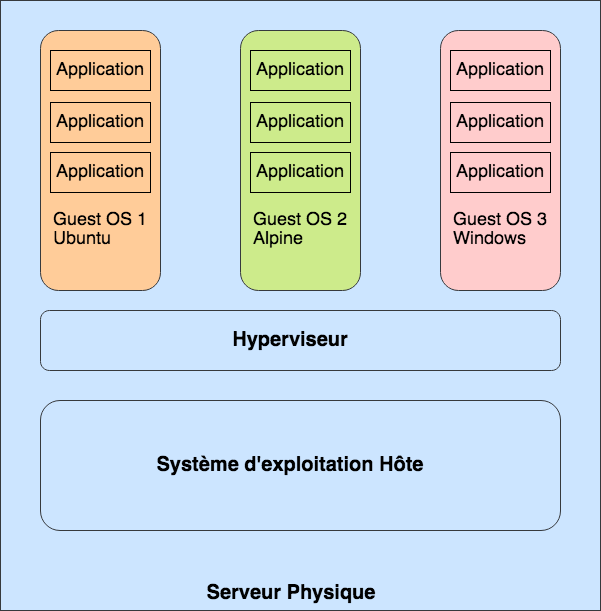
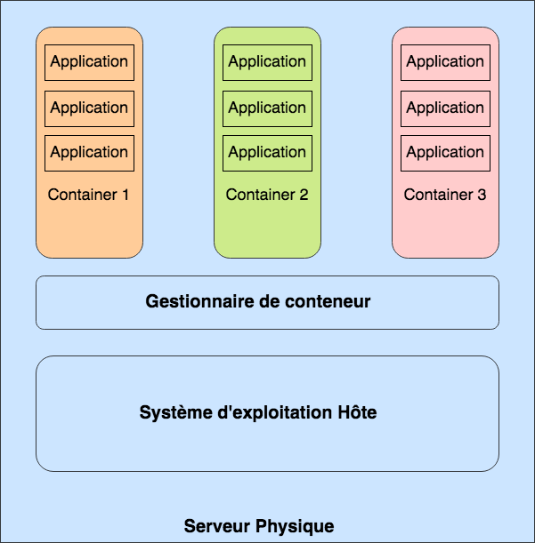

# Services de la Plateforme Google Cloud Platform

[`Google Cloud Platform`](https://cloud.google.com/) est une plateforme offrant une suite de services cloud (Calcul, Stockage et réseau) à ses clients. Les petites organisations se contentent très souvent de machines virtuelles (VMs) et de stockage, tandis que les grandes entreprises consomment en plus des Clusters, des bases de données BigData ou encore des Services Spécialisés.

l'objectif de ce chapitre est de présenter et de décrire les cas d'usage des services importants proposés par [`Google Cloud Platform`](https://cloud.google.com/).

À la fin du chapitre, le lecteur devra être familier avec chacun des services des différentes catégories offertes par GCP

1. __***`Composants de calcul`***__
    * Google Compute Engine
    * Google Kubernetes Engine
    * Google AppEngine
    * Google Cloud Functions
2. __***`Composants de stockage`***__
    * Google Cloud Storage
    * Google Persistent Disk
    * Google Cloud Storage for Firebase
    * Google Cloud Filestore
    * Google Databases
    * Google Cloud SQL
    * Google Cloud bigTable
    * Google Cloud Spanner
    * Google Cloud Datastore
    * Google Cloud Meorystore
    * Google Firestore
3. __***`Composants réseau`***__
    * Google Virtual Private Cloud (VPC)
    * Google Cloud Load Balacing
    * Google Cloud Armor
    * Coogle Cloud CDN
    * Google Cloud Interconnect
    * Google Cloud DNS
    * Google Identity Management (IAM)
    * Google Development Tools
4. __***`Composants additionnels`***__
    * Google Management Tools
    * Google Specialized Services
        * Google Apigee API Platform
        * Google Data Analytics
        * Google Artificial Intelligence and Machine Learning

## ***Composants de calcul de la plateforme Google Cloud (GCP)***

### ***Ressources de calcul (Compute Resources)***

Les ressource de calcul de la plateforme GCP offrent au client des services suivant différents modèles d'utilisation

* Le modèle `IaaS (Infrastructure As A Service)`, dénommé `Google Compute Engine`, c'est modèle dans lequel le client peut créer, configurer et administrer des VMs; Il peut notament:
  * Choisir le système d'exploitation à installer
  * Configurer la mémoire nécessaire
  * Configurer les CPUs (nombre et technologies)
  * Provisionner et associer des disques
  * Effectuer toutes sorte de tâches d'administration, de sauvegarde et restauration sur les VMs crées
  * Associer les VMs à un Network
  * etc..

  __***En gros c'est un modèle dans lequel le client assure lui-même la gestion de ses VMs.***__

  __***Les services IaaS de GCP sont :***__
  * `Google Compute Engine (GCE)`

* Le modèle `PaaS (Platform As A Service)`, c'est une alternative au modèle `IaaS`, fournissant au client un environnement de déploiement et d'exécution d'application, sans les contraintes de création et d'administration de VMs, de stockage ou de réseau. Le client peut ainsi se concentrer sur son application en laissant à la plateforme la gestion de l'infrastructure serveur et réseau.

  __***En gros c'est un modèle dans lequel la plateforme Cloud assure la gestion de l'infrastructure et le client se concentre sur la gestion de son service applicatif.***__

  __***Les services PaaS de GCP sont :***__
  * `Google AppEngine`
  * `Google Cloud Functions`

* Le modèle `PaaS géré par le Client`, c'est un modèle dans lequel le client lui-même instancie et administre lui-même son environnement de gestion de conteneurs applicatifs (Docker/RKT).

  __***Les services PaaS Client de GCP sont :***__
  * `Google Kubernetes Engine (GKE)`

#### Présentation des services de calcul

1. `Google Compute Engine (GCE)`

    * Service permettant aux client :
        * Créer des VMs
        * Attacher du stockage persistent au VMs
        * Exploiter d'autre services (`Cloud Storage (Stockage Objet)`)
        * Effectuer des tâches d'administrtaions diverses
        * etc...
    * Les VMs sont des abstraction des machines physiques, des programmes qui émulent les machine physiques et fournissent CPU, Mémoire, Stockage et d'autres services
    * Les VMs sont crées et exécutées par des hyperviseurs, qui sont des programmes d'exploitation des ressources physiques (comme des OS), et dont le seul objectif est de permettre de créer et gérer des VMs
    * Pour mettre en oeuvre le service `GCE`, `GCP` utilise un hyerviseur de type 1, basé sur `KVM (Kernel Virtual Machine)`
    * `KVM (Kernel Virtual Machine)` est une technologie de virtualisation intégrée au noyau Linux depuis la version `2.6.20` (basé sur les package `libvirt`, `quemu-kvm`). `KVM` permet de transformer `Linux` en hyperviseur permettant ainsi à la machine hôte d'exécuter plusieurs environnements isolés (les machine virtuelles)
    * Un hyperviseur (comme `KVM`) permet d'exécuter plusieurs instances de systèmes d'exploitation appelé `Système invité`.
    * Dans le cas de `GCE`, `KVM` joue le rôle de `Système d'exploitation`, et met à disposition un programme d'`Hypervision` permettant de gérer des VMs.

    

    * Lorsqu'on crée une VM, nous avons la possibilité de configurer plusieurs aspects parmis lesquels :
        * Le modèle de VM, choisi parmis des modèles existant ou personalisés (choix implicite du CPU et de la RAM)
        * Le CPU
        * La RAM
        * La taiile et le nombre de disques persistants
        * Le système d'exploitation
        * Les unités de calcul Graphiques (CPU graphiques) si la machine est destinée à des calculs intensif comme le Machine Learning
        * Les Tags réseau
        * L'interface réseau
        * Les règles de parefeu de bases (http/https)
        * Les clés SSH autorisées à se connecter à la VM
        * Les scripts à exécuter au démarrage de la VM
        * La préemptibilité de la machine
            * Une machine préemptible coûtera beaucoup moins cher (80% moins cher) qu'une machine normale, mais la contrepartie étant qu'il n'ya aucune garantie de disponibilité. Elle peut être arrêtée à tout moment par GCP dépendament des besoins de la plateforme. En général, elle sera arrêtée après 24H d'exécution continue

2. `Google Kubernetes Engine (GKE)`

    * `Google Kubernetes Engine` est un service permettant de créer un Cluster `Kubernetes` managé et optimisé par Google pour l'exploitation de la puissance du cloud GCP.
    * `Google Kubernetes Engine` permet au utilisateurs de décrire entre autres la puissance de calcul, de stockage, de mémoire qui sera embarquée dans le cluster. `GKE` se chargera alors de provisionner ces ressources afin d'avoir un cluster conforme à la description.
    * `Google Kubernetes Engine` permet aussi de rajouter facilement des ressources au Cluster, de manière manuelle ou automatique (via un `Autoscaler`).
    * Le cluster `Kubernetes` ainsi créee va
        * Monitorer l'état de santé des ressources serveurs dont l a la charge
        * Monitorer la consommation des ressources de chaque serveur
        * Gérer des problèmes de base tel que des noeuds qui tombent en panne
        * Gérer des stratégie de mise à l'échelle (`Scaling`)
    * Ce service permet aux utilisateur d'exécuter des application conteneurisées sur un Cluster de Serveurs
    * Les conteneurs est un cloisonnement de ressources (calcul, stockage, réseau) permettant d'exécuter un ensemble de processus de manière isolée.
    * Les conteneurs peuvent être comparés à des VMs uniquement du point de vue de l'solation de ressources.
    * Contrairement aux VMs qui s'exécutent sur un `Hyperviseur`, lui-même installé au-dessus d'un `Système d'exploitation`, les conteneurs quant à eux ne nécessitent pas d'hyperviseur.
    * Dans l'approche conteneur, il n'ya aucun `Hyperviseur` et aucun système d'exploitation `invité`, les conteneurs s'exécutent directement le système d'exploitation `Hôte` qui assure le cloisonnement de processus et de ressources grâce à un `Gestionnaire de conteneurs`

    

3. `Google AppEngine`

    * `App Engine` est l'offre `PaaS (Platform As A Service)` de `GCP`.
    * `App Engine` fournit à ses clients une plateforme `Serverless` de déploiement et d'exécution d'application
    * `App Engine` permet aux développeurs et administrateurs, de déployer et exécuter des applications (`Java`, `Python`, `C#`, `Go`, `PHP`, `NodeJS`, etc...) sans avoir à créer et configurer des VMs, des Clusters Kubernetes ou encore du Stockage, ou du Réseau.
    * `App Engine` va gérer de manière transparente, toute les problématique d'infrastructure de calcul, de stockage et de réseau sous-jacentes au déploiement des applications.
    * `App Engine` est très adapté pour le déploiement de back-end pour application web ou mobile.
    * `App Engine` offre deux types d'environnement de déploiement
        * `Standard`, votre application est exécutée dans un environnement préconfiguré pour un langage spécifique. il est indiqué pour l'exécution d'applications compatible avec un des langages supportés et qui ne nécessitent aucun package système spécifique ou autre logiciels dépendants.
        * `Flexible`, permet d'exécuter des conteneurs Docker. Il est indiqué pour des applications nécessitant des librairies et initialisation particulières. Il offre beaucoup plus de possibilité de personnalisation et permet notament de gérer des processus et d'écrire sur des disque locaux.

4. `Google Cloud Functions`

    * `Google Cloud Functions` est un environnement d'exécution allégé, adapté pour l'exécution de callbacks traitement d'évènements tels que :
        * L'upload d'un fichier dans un Bucket `Google Cloud Storage`
        * L'écriture d'un message dans une file ou un topic
    * Le code exécuté par `Google Cloud Functions` doit être de courte durée
    * Pour l'exécution de code longue durée, il vaut mieux choisir des options telles que :
        * `Google Compute Engine`
        * `Google Kubernetes Engine`
        * `Google App Engine`
    * `Google Cloud Functions` est surtout utilisé pour invoquer d'autre services (Une API applicative, un service GCP, etc...) en réaction à un évènement spécifique.
    * `Google Cloud Functions` est `Serverless` tout comme `Google Cloud Functions`

## ***Composants de stockage de la plateforme Google Cloud (GCP)***

Certaines applications ou services ont besoin de stocker et accéder aux données stockées de manière ultra-rapide, tandis que d'autres on besoin de stocker de gros volumes de données en tolérant des latences dans le traitement.

GCP met à disposition un ensemble de ressources et services de stockage dans le bit d'accompagner ces besoins d'application Clientes.

### ***Ressources de stockage (Storage Resources)***

1. `Google Cloud Storage`

    * `Google Cloud Storage` est Service de stockage objet proposé par GCP
    * `Google Cloud Storage` organise le stockage des objets dans les `Buckets`
    * Un `Objet` représente un fichier ou un `BLOB (Binary Large OBject)`. C'est une unité indivisible, qui est lu ou écrite de manière unitaire en une opération
    * `Google Cloud Storage` n'est pas du tout un système de fichier (comme NFX, EXT4, etc...)
    * `Google Cloud Storage` est uniquement un service permettant de recevoir, stocker et renvoyer des fichier ou plus généralement des objets depuis un système de fichier distribué
    * Les `Buckets` de `Cloud Storage` sont complètement indépendants d'une quelconque VM, il ne peuvent pas rattachés à une VM comme pourrait l'être un disque persistant.
    * Les `Buckets` de `Cloud Storage` sont accessible d'une VM, comme de n'importe quel équipement disposant de l'URL du `Bucket` ainsi que des droits d'accès adéquats
    * Chaque objet stocké dans un `Bucket` est identifiable de manière unique par un URL.
        * Par exemple, si nous avons un document `content.pdf`, associé au `Bucket` `document-exam-guide`, il peut être identifié par l'URL : ***`https://storage.cloud.google.com/document-exam-guide/content.pdf`***
    * Les utilisateurs et applications peuvent se voir attribuer, via le service de gestion des droits (IAM), des autorisations en lecture/écriture pour pouvoir accéder objets contenus dans un `Bucket`
    * `Google Cloud Storage` est très recommandé pour le stockage et l'accès aux fichiers volumineux, qui sont géré de manière unitaire,.
        * `Les archives`, qui sont stockées et récupérées unitairement pour être traité
        * `Les images`, qui sont enregistrées et récupérées en une fois de manière unitaire, entière. il est très rare et très spécifique de rechercher un partie d'une image)
        * etc...
    * En général `Google Cloud Storage` sera l'option à considérer, si vous avez besoin de stocker des objets indivisible, de manière indépendante d'un serveur
    * Il existe plusieurs classe de `Cloud Storage`. Chaque classe de stockage représente en réalité une offre permettant de choisir l'emplacement et la (géo-)réplication des données de vos `Buckets`.
        * `Régional`
            * les données de vos `Buckets` sont stockée dans une seule région (par exemple `Londres`)
            * les temps d'accès sont optimisés pour les utilisateurs ou services déployés dans la même région
            * dans le cas d'une panne dans une région, les objets stockés dans des `Buckets` de cette région ne sont plus accessibles le temps de la panne.
        * `Bi-Régional`
            * Les données de vos `Buckets` sont redondés dans deux régions (Par exemple Finlande et des Pays-Bas)
            * Les performances d'accès ssuivent les même règles que le stockage régional
            * À utiliser lorsqu'on souhaite atteindre les performances du stockage régional avec en bonus la géo-redondance des données.
        * `Multi-régional`
            * Les données de vos `Buckets` sont géo-redondés dans un secteur géographique de très grande étendue (Par exemple Etats-Unis) qui coomporte plusieurs régions
            * Les données de vos `Buckets` sont géo-redondés dans toutes les régions du secteur choisi
            * À utiliser lorsqu'on souhaite atteindre des utilisateurs qui sont en dehors du réseau Google, réparties dans plusieurs régions ou lorsqu'on veut profiter d'un très grand niveau de redondance
    * Il es fortement recommandé de stocker ses données dans des emplacements qui regroupent la grande majorité de nos utilisateurs.
    * Le stockage multirégional diminue la latence d'accès aux objets stockés du fait que les application qui les exloitent peuvent aaccéder aux instances qui sont le plus proche d'elles.

2. `Google Persistent Disk`

    * `Google Persistent Disk` est Service de stockage Block proposé par GCP
    * `Google Persistent Disk` propose des disque exclusivement rattachés à des VMs ou au moteur `Kubernetes`
    * Les disque `Google Persistent Disk` stockent sur des supports SSD, pour un maximum de performance (faible latence comparée à HDD)
    * Les disques `Google Persistent Disk` supportent des lectures multiples sans dégradation de performances, du coup, plusieurs instances de VMs ou de conteneurs peuvent lire en parallèle sur le même disque persistant tout en gardant des performances de lecture élevées.
    * La taille des disques persistants peut aller jusqu'à 64TB

3. `Google Cloud Storage for Firebase`

    * `Google Cloud Storage for Firebase` est un ensemble d'API, construit au-dessus de `Google Cloud Storage`, permettant aux développeurs mobile de pouvoir stocker des fichiers (photos, videos, son, etc.) de façon sécurisée.
    * `Google Cloud Storage for Firebase` est conçu pour supporter des transmission de données sécurisées et propose aussi un mécanisme de recovery permettant de supporter même des réseaux instables.
    * Une fois qu'un fichier est stocké, on peu y accéder via la ligne de commande `Cloud Storage` ou via le SDK mis à disposition des développeurs.
    * À noter que `Google Firebase` est une plateforme de développement et de déploement d'applications back-end pour le mobile. Cette plateforme fournit aux applications un ensemble de service répartis en deux catégories :
        * Les outils de développement et de test
            * Authentification et Authorisation
            * Base de données RealTimes (NoSQL)
            * Monitoring applicatif
            * La messagerie (Firebase Cloud Messaging [EDA])
        * Les outils de mareting

4. `Google Cloud Filestore`

    * `Google Cloud Filestore` propose un système de fichiers partagé qui peut être utilisé par `Cloud Engine` (via l'installation de client NFS et la commande `mount`) et `Kubernetes Engine` (via la création de volume persistent avec un driver nfs).
    * Contrairement aux `Persistent Disk`, les instances `Filestore` ne sont pas associées comme disques internes lors de la création de VM.
    * `Google Cloud Filestore` implémente le protocole NFS (Network File System) et permet donc aux administrateurs de monter des systèmes de fichier partagés sur des serveurs virtuels.
    * `Google Cloud Filestore` Supporte un grand nombre d'IOPS (Input-output Operation Per Second) ainsi qu'une capacité variable qui peut être configurée par l'administrateur.
    * `Google Cloud Filestore`

### ***Base de données (Databases)***

GCP propose plusieurs types de services base de données. Certaines sont relationnelles, d'autres NoSQL. Certaines sont Serverless et d'autre nécessitent que l'utilisateur manipule des VM ou des clusters. Certaines encore fournissent le support Transactionnel et d'autres non.

1. `Google Cloud SQL`

    * `Google Cloud SQL` fournit un ervice de base de données relationnel
    * `Google Cloud SQL` permet de créér des base de données `MySQL` et `PostgreSQL`
    * `Google Cloud SQL` est disponible en plusieurs configurations parmis lesquelles les configurations
        * ***`MySQL première génération`***, qui propose les caractéristiques suivantes
            * ***`MySQL 5.5`*** ou ***`MySQL 5.6`***
            * `16GB RAM` Maximum
            * `500GB` Max
            * Stockage non ajustable (aucun moyen automatiqued'augmenter la capacité de stockage)
        * ***`MySQL deuxième génération`***, qui propose les caractéristiques suivantes
            * ***`MySQL 5.6`*** ou ***`MySQL 5.7`***
            * `416GB RAM` Maximum
            * `10TB` Max
            * Stockage ajustable automatiquement (Il est possible de rajouter du stockage)
        * ***`PostgreSQL`***, qui propose les caractéristiques suivantes
            * ***`PostgreSQL 9.6`***
            * `64 CPU` Maximum
            * `416GB RAM` Maximum
            * `10TB` Max
            * Stockage ajustable automatiquement (Il est possible de rajouter du stockage)
            * Support de `PostGIS` pour les informations géographiques
            * Support de `HTABLE` pour le stockage `Clé-Valeur`
    * `Google Cloud SQL` supporte nativement la réplication ainsi que le failover pour la haute disponibilité des bases de données

2. `Google Cloud Bigtable`

    * `Google Cloud Bigtable` propose un service de base de donnée NoSQL de type `Wide Column data model`
    * ***Les base de données NoSQL de type `column wide store` sont à utiliser avec des applications qui manipulent un très grand nombre de colonnes (des centaines) couplés à un très grand nombre de lignes (des milliards)***
    * `Google Cloud Bigtable` est une solution NoSQL comparable à d'autre base noSQL de type `Wide column store`
        * Apache cassandra
        * DynamoDB
        * HBase
        * Datastax (Luna, enterprise, Astra)
    * `Google Cloud Bigtable` peut supporter des millions d'opérations pa secondes (comme tout BigData)
    * `Google Cloud Bigtable` exécute des opération R/W avec une très faible latence (comme tout BigData)
    * `Google Cloud Bigtable` a été mis en place pour des applications qui nécessitent
        * Une très faible latence dans les opérations de lecture/écritures
        * Un très grand nombre d'opérations par seconde
    * `Google Cloud Bigtable` s'intègre avec un ensemble de services `GCP`
        * `Google Cloud Storage`
        * `Google Cloud Pub/Sub`
        * `Google Cloud Dataproc`
    * `Google Cloud Bigtable` supporte aussi `HBase API` qui est une API d'accès aux données venu de l'écosystème `Hadoop`
    * `Google Cloud Bigtable` s'intègre aussi avec un grande variété d'outils Open Source pour
        * Le traitement de données
        * l'analyse de données (via des graphs)
        * L'analyse de données de séries temporelles

3. `Google Cloud Spanner`

    * `Google Cloud Spanner` est un service de base de données relationnelle hautement disponible basé sur un système de gestion de base de donnée relationnel (SGBDR) du même nom [`Spanner`] développé par `Google` en 2017
    * Le `SGBDR Spanner` se positionne comme un concurrent immédiat et très sérieux des SGBDR classique du fait qu'il apporte les avantages des deux mondes (SQL et NoSQL):
        * Le support des transaction et de la consistence du monde relationnel
        * Le support de la scalabilité horizontale native du monde NoSQL
    * `Google Cloud Spanner` permet donc, grâce au `SGBDR Spanner` d'avoir une SLA de 99,999% de disponibilité

4. `Google Cloud Datastore`
5. `Google Cloud Memorystore`
6. `Google Cloud Firestore`

## ***Composants de networking de la plateforme Google Cloud (GCP)***

1. Service réseau (Networking Services)
2. Gestion des indentités (Identity Management)
3. Outils de développement (Development Tools)

## ***Composants additionnels de la plateforme Google Cloud (GCP)***

1. Services de gestion (Management Services)
2. Services spécialisés (Specialized Services)
