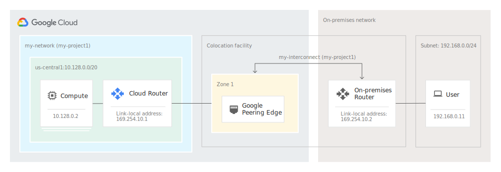

# Services de la Plateforme Google Cloud Platform

[`Google Cloud Platform`](https://cloud.google.com/) est une plateforme offrant une suite de services cloud (Calcul, Stockage et réseau) à ses clients. Les petites organisations se contentent très souvent de machines virtuelles (VMs) et de stockage, tandis que les grandes entreprises consomment en plus des Clusters, des bases de données BigData ou encore des Services Spécialisés.

l'objectif de ce chapitre est de présenter et de décrire les cas d'usage des services importants proposés par [`Google Cloud Platform`](https://cloud.google.com/).

À la fin du chapitre, le lecteur devra être familier avec chacun des services des différentes catégories offertes par GCP

1. __***`Composants de calcul`***__
    * Google Compute Engine
    * Google Kubernetes Engine
    * Google AppEngine
    * Google Cloud Functions
2. __***`Composants de stockage`***__
    * Google Cloud Storage
    * Google Persistent Disk
    * Google Cloud Storage for Firebase
    * Google Cloud Filestore
    * Google Databases
    * Google Cloud SQL
    * Google Cloud bigTable
    * Google Cloud Spanner
    * Google Cloud Datastore
    * Google Cloud Meorystore
    * Google Firestore
3. __***`Composants réseau`***__
    * Google Virtual Private Cloud (VPC)
    * Google Cloud Load Balacing
    * Google Cloud Armor
    * Coogle Cloud CDN
    * Google Cloud Interconnect
    * Google Cloud DNS
    * Google Identity Management (IAM)
    * Google Development Tools
4. __***`Composants additionnels`***__
    * Google Management Tools
    * Google Specialized Services
        * Google Apigee API Platform
        * Google Data Analytics
        * Google Artificial Intelligence and Machine Learning

## ***Composants de calcul de la plateforme Google Cloud (GCP)***

### ***Ressources de calcul (Compute Resources)***

Les ressource de calcul de la plateforme GCP offrent au client des services suivant différents modèles d'utilisation

* Le modèle `IaaS (Infrastructure As A Service)`, dénommé `Google Compute Engine`, c'est modèle dans lequel le client peut créer, configurer et administrer des VMs; Il peut notament:
  * Choisir le système d'exploitation à installer
  * Configurer la mémoire nécessaire
  * Configurer les CPUs (nombre et technologies)
  * Provisionner et associer des disques
  * Effectuer toutes sorte de tâches d'administration, de sauvegarde et restauration sur les VMs crées
  * Associer les VMs à un Network
  * etc..

  __***En gros c'est un modèle dans lequel le client assure lui-même la gestion de ses VMs.***__

  __***Les services IaaS de GCP sont :***__
  * `Google Compute Engine (GCE)`

* Le modèle `PaaS (Platform As A Service)`, c'est une alternative au modèle `IaaS`, fournissant au client un environnement de déploiement et d'exécution d'application, sans les contraintes de création et d'administration de VMs, de stockage ou de réseau. Le client peut ainsi se concentrer sur son application en laissant à la plateforme la gestion de l'infrastructure serveur et réseau.

  __***En gros c'est un modèle dans lequel la plateforme Cloud assure la gestion de l'infrastructure et le client se concentre sur la gestion de son service applicatif.***__

  __***Les services PaaS de GCP sont :***__
  * `Google AppEngine`
  * `Google Cloud Functions`

* Le modèle `PaaS géré par le Client`, c'est un modèle dans lequel le client lui-même instancie et administre lui-même son environnement de gestion de conteneurs applicatifs (Docker/RKT).

  __***Les services PaaS Client de GCP sont :***__
  * `Google Kubernetes Engine (GKE)`

#### Présentation des services de calcul

1. `Google Compute Engine (GCE)`

    * Service permettant aux client :
        * Créer des VMs
        * Attacher du stockage persistent au VMs
        * Exploiter d'autre services (`Cloud Storage (Stockage Objet)`)
        * Effectuer des tâches d'administrtaions diverses
        * etc...
    * Les VMs sont des abstraction des machines physiques, des programmes qui émulent les machine physiques et fournissent CPU, Mémoire, Stockage et d'autres services
    * Les VMs sont crées et exécutées par des hyperviseurs, qui sont des programmes d'exploitation des ressources physiques (comme des OS), et dont le seul objectif est de permettre de créer et gérer des VMs
    * Pour mettre en oeuvre le service `GCE`, `GCP` utilise un hyerviseur de type 1, basé sur `KVM (Kernel Virtual Machine)`
    * `KVM (Kernel Virtual Machine)` est une technologie de virtualisation intégrée au noyau Linux depuis la version `2.6.20` (basé sur les package `libvirt`, `quemu-kvm`). `KVM` permet de transformer `Linux` en hyperviseur permettant ainsi à la machine hôte d'exécuter plusieurs environnements isolés (les machine virtuelles)
    * Un hyperviseur (comme `KVM`) permet d'exécuter plusieurs instances de systèmes d'exploitation appelé `Système invité`.
    * Dans le cas de `GCE`, `KVM` joue le rôle de `Système d'exploitation`, et met à disposition un programme d'`Hypervision` permettant de gérer des VMs.

    

    * Lorsqu'on crée une VM, nous avons la possibilité de configurer plusieurs aspects parmis lesquels :
        * Le modèle de VM, choisi parmis des modèles existant ou personalisés (choix implicite du CPU et de la RAM)
        * Le CPU
        * La RAM
        * La taiile et le nombre de disques persistants
        * Le système d'exploitation
        * Les unités de calcul Graphiques (CPU graphiques) si la machine est destinée à des calculs intensif comme le Machine Learning
        * Les Tags réseau
        * L'interface réseau
        * Les règles de parefeu de bases (http/https)
        * Les clés SSH autorisées à se connecter à la VM
        * Les scripts à exécuter au démarrage de la VM
        * La préemptibilité de la machine
            * Une machine préemptible coûtera beaucoup moins cher (80% moins cher) qu'une machine normale, mais la contrepartie étant qu'il n'ya aucune garantie de disponibilité. Elle peut être arrêtée à tout moment par GCP dépendament des besoins de la plateforme. En général, elle sera arrêtée après 24H d'exécution continue

2. `Google Kubernetes Engine (GKE)`

    * `Google Kubernetes Engine` est un service permettant de créer un Cluster `Kubernetes` managé et optimisé par Google pour l'exploitation de la puissance du cloud GCP.
    * `Google Kubernetes Engine` permet au utilisateurs de décrire entre autres la puissance de calcul, de stockage, de mémoire qui sera embarquée dans le cluster. `GKE` se chargera alors de provisionner ces ressources afin d'avoir un cluster conforme à la description.
    * `Google Kubernetes Engine` permet aussi de rajouter facilement des ressources au Cluster, de manière manuelle ou automatique (via un `Autoscaler`).
    * Le cluster `Kubernetes` ainsi créee va
        * Monitorer l'état de santé des ressources serveurs dont l a la charge
        * Monitorer la consommation des ressources de chaque serveur
        * Gérer des problèmes de base tel que des noeuds qui tombent en panne
        * Gérer des stratégie de mise à l'échelle (`Scaling`)
    * Ce service permet aux utilisateur d'exécuter des application conteneurisées sur un Cluster de Serveurs
    * Les conteneurs est un cloisonnement de ressources (calcul, stockage, réseau) permettant d'exécuter un ensemble de processus de manière isolée.
    * Les conteneurs peuvent être comparés à des VMs uniquement du point de vue de l'solation de ressources.
    * Contrairement aux VMs qui s'exécutent sur un `Hyperviseur`, lui-même installé au-dessus d'un `Système d'exploitation`, les conteneurs quant à eux ne nécessitent pas d'hyperviseur.
    * Dans l'approche conteneur, il n'ya aucun `Hyperviseur` et aucun système d'exploitation `invité`, les conteneurs s'exécutent directement le système d'exploitation `Hôte` qui assure le cloisonnement de processus et de ressources grâce à un `Gestionnaire de conteneurs`

    

3. `Google AppEngine`

    * `App Engine` est l'offre `PaaS (Platform As A Service)` de `GCP`.
    * `App Engine` fournit à ses clients une plateforme `Serverless` de déploiement et d'exécution d'application
    * `App Engine` permet aux développeurs et administrateurs, de déployer et exécuter des applications (`Java`, `Python`, `C#`, `Go`, `PHP`, `NodeJS`, etc...) sans avoir à créer et configurer des VMs, des Clusters Kubernetes ou encore du Stockage, ou du Réseau.
    * `App Engine` va gérer de manière transparente, toute les problématique d'infrastructure de calcul, de stockage et de réseau sous-jacentes au déploiement des applications.
    * `App Engine` est très adapté pour le déploiement de back-end pour application web ou mobile.
    * `App Engine` offre deux types d'environnement de déploiement
        * `Standard`, votre application est exécutée dans un environnement préconfiguré pour un langage spécifique. il est indiqué pour l'exécution d'applications compatible avec un des langages supportés et qui ne nécessitent aucun package système spécifique ou autre logiciels dépendants.
        * `Flexible`, permet d'exécuter des conteneurs Docker. Il est indiqué pour des applications nécessitant des librairies et initialisation particulières. Il offre beaucoup plus de possibilité de personnalisation et permet notament de gérer des processus et d'écrire sur des disque locaux.

4. `Google Cloud Functions`

    * `Google Cloud Functions` est un environnement d'exécution allégé, adapté pour l'exécution de callbacks traitement d'évènements tels que :
        * L'upload d'un fichier dans un Bucket `Google Cloud Storage`
        * L'écriture d'un message dans une file ou un topic
    * Le code exécuté par `Google Cloud Functions` doit être de courte durée
    * Pour l'exécution de code longue durée, il vaut mieux choisir des options telles que :
        * `Google Compute Engine`
        * `Google Kubernetes Engine`
        * `Google App Engine`
    * `Google Cloud Functions` est surtout utilisé pour invoquer d'autre services (Une API applicative, un service GCP, etc...) en réaction à un évènement spécifique.
    * `Google Cloud Functions` est `Serverless` tout comme `Google Cloud Functions`

## ***Composants de stockage de la plateforme Google Cloud (GCP)***

Certaines applications ou services ont besoin de stocker et accéder aux données stockées de manière ultra-rapide, tandis que d'autres on besoin de stocker de gros volumes de données en tolérant des latences dans le traitement.

GCP met à disposition un ensemble de ressources et services de stockage dans le bit d'accompagner ces besoins d'application Clientes.

### ***Ressources de stockage (Storage Resources)***

1. `Google Cloud Storage`

    * `Google Cloud Storage` est Service de stockage objet proposé par GCP
    * `Google Cloud Storage` organise le stockage des objets dans les `Buckets`
    * Un `Objet` représente un fichier ou un `BLOB (Binary Large OBject)`. C'est une unité indivisible, qui est lu ou écrite de manière unitaire en une opération
    * `Google Cloud Storage` n'est pas du tout un système de fichier (comme NFX, EXT4, etc...)
    * `Google Cloud Storage` est uniquement un service permettant de recevoir, stocker et renvoyer des fichier ou plus généralement des objets depuis un système de fichier distribué
    * Les `Buckets` de `Cloud Storage` sont complètement indépendants d'une quelconque VM, il ne peuvent pas rattachés à une VM comme pourrait l'être un disque persistant.
    * Les `Buckets` de `Cloud Storage` sont accessible d'une VM, comme de n'importe quel équipement disposant de l'URL du `Bucket` ainsi que des droits d'accès adéquats
    * Chaque objet stocké dans un `Bucket` est identifiable de manière unique par un URL.
        * Par exemple, si nous avons un document `content.pdf`, associé au `Bucket` `document-exam-guide`, il peut être identifié par l'URL : ***`https://storage.cloud.google.com/document-exam-guide/content.pdf`***
    * Les utilisateurs et applications peuvent se voir attribuer, via le service de gestion des droits (IAM), des autorisations en lecture/écriture pour pouvoir accéder objets contenus dans un `Bucket`
    * `Google Cloud Storage` est très recommandé pour le stockage et l'accès aux fichiers volumineux, qui sont géré de manière unitaire,.
        * `Les archives`, qui sont stockées et récupérées unitairement pour être traité
        * `Les images`, qui sont enregistrées et récupérées en une fois de manière unitaire, entière. il est très rare et très spécifique de rechercher un partie d'une image)
        * etc...
    * En général `Google Cloud Storage` sera l'option à considérer, si vous avez besoin de stocker des objets indivisible, de manière indépendante d'un serveur
    * Il existe plusieurs classe de `Cloud Storage`. Chaque classe de stockage représente en réalité une offre permettant de choisir l'emplacement et la (géo-)réplication des données de vos `Buckets`.
        * `Régional`
            * les données de vos `Buckets` sont stockée dans une seule région (par exemple `Londres`)
            * les temps d'accès sont optimisés pour les utilisateurs ou services déployés dans la même région
            * dans le cas d'une panne dans une région, les objets stockés dans des `Buckets` de cette région ne sont plus accessibles le temps de la panne.
        * `Bi-Régional`
            * Les données de vos `Buckets` sont redondés dans deux régions (Par exemple Finlande et des Pays-Bas)
            * Les performances d'accès ssuivent les même règles que le stockage régional
            * À utiliser lorsqu'on souhaite atteindre les performances du stockage régional avec en bonus la géo-redondance des données.
        * `Multi-régional`
            * Les données de vos `Buckets` sont géo-redondés dans un secteur géographique de très grande étendue (Par exemple Etats-Unis) qui coomporte plusieurs régions
            * Les données de vos `Buckets` sont géo-redondés dans toutes les régions du secteur choisi
            * À utiliser lorsqu'on souhaite atteindre des utilisateurs qui sont en dehors du réseau Google, réparties dans plusieurs régions ou lorsqu'on veut profiter d'un très grand niveau de redondance
    * Il es fortement recommandé de stocker ses données dans des emplacements qui regroupent la grande majorité de nos utilisateurs.
    * Le stockage multirégional diminue la latence d'accès aux objets stockés du fait que les application qui les exloitent peuvent aaccéder aux instances qui sont le plus proche d'elles.

2. `Google Persistent Disk`

    * `Google Persistent Disk` est Service de stockage Block proposé par GCP
    * `Google Persistent Disk` propose des disque exclusivement rattachés à des VMs ou au moteur `Kubernetes`
    * Les disque `Google Persistent Disk` stockent sur des supports SSD, pour un maximum de performance (faible latence comparée à HDD)
    * Les disques `Google Persistent Disk` supportent des lectures multiples sans dégradation de performances, du coup, plusieurs instances de VMs ou de conteneurs peuvent lire en parallèle sur le même disque persistant tout en gardant des performances de lecture élevées.
    * La taille des disques persistants peut aller jusqu'à 64TB

3. `Google Cloud Storage for Firebase`

    * `Google Cloud Storage for Firebase` est un ensemble d'API, construit au-dessus de `Google Cloud Storage`, permettant aux développeurs mobile de pouvoir stocker des fichiers (photos, videos, son, etc.) de façon sécurisée.
    * `Google Cloud Storage for Firebase` est conçu pour supporter des transmission de données sécurisées et propose aussi un mécanisme de recovery permettant de supporter même des réseaux instables.
    * Une fois qu'un fichier est stocké, on peu y accéder via la ligne de commande `Cloud Storage` ou via le SDK mis à disposition des développeurs.
    * À noter que `Google Firebase` est une plateforme de développement et de déploiement d'applications back-end pour le mobile. Cette plateforme fournit aux applications un ensemble de service répartis en deux catégories :
        * Les outils de développement et de test
            * Authentification et Authorisation
            * Base de données RealTimes (NoSQL)
            * Monitoring applicatif
            * La messagerie (Firebase Cloud Messaging [EDA])
        * Les outils de mareting

4. `Google Cloud Filestore`

    * `Google Cloud Filestore` propose un système de fichiers partagé qui peut être utilisé par `Cloud Engine` (via l'installation de client NFS et la commande `mount`) et `Kubernetes Engine` (via la création de volume persistent avec un driver nfs).
    * Contrairement aux `Persistent Disk`, les instances `Filestore` ne sont pas associées comme disques internes lors de la création de VM.
    * `Google Cloud Filestore` implémente le protocole NFS (Network File System) et permet donc aux administrateurs de monter des systèmes de fichier partagés sur des serveurs virtuels.
    * `Google Cloud Filestore` Supporte un grand nombre d'IOPS (Input-output Operation Per Second) ainsi qu'une capacité variable qui peut être configurée par l'administrateur.
    * `Google Cloud Filestore`

### ***Base de données (Databases)***

GCP propose plusieurs types de services base de données. Certaines sont relationnelles, d'autres NoSQL. Certaines sont Serverless et d'autre nécessitent que l'utilisateur manipule des VM ou des clusters. Certaines encore fournissent le support Transactionnel et d'autres non.

1. `Google Cloud SQL`

    * `Google Cloud SQL` fournit un ervice de base de données relationnel
    * `Google Cloud SQL` permet de créér des base de données `MySQL` et `PostgreSQL`
    * `Google Cloud SQL` est disponible en plusieurs configurations parmis lesquelles les configurations
        * ***`MySQL première génération`***, qui propose les caractéristiques suivantes
            * ***`MySQL 5.5`*** ou ***`MySQL 5.6`***
            * `16GB RAM` Maximum
            * `500GB` Max
            * Stockage non ajustable (aucun moyen automatiqued'augmenter la capacité de stockage)
        * ***`MySQL deuxième génération`***, qui propose les caractéristiques suivantes
            * ***`MySQL 5.6`*** ou ***`MySQL 5.7`***
            * `416GB RAM` Maximum
            * `10TB` Max
            * Stockage ajustable automatiquement (Il est possible de rajouter du stockage)
        * ***`PostgreSQL`***, qui propose les caractéristiques suivantes
            * ***`PostgreSQL 9.6`***
            * `64 CPU` Maximum
            * `416GB RAM` Maximum
            * `10TB` Max
            * Stockage ajustable automatiquement (Il est possible de rajouter du stockage)
            * Support de `PostGIS` pour les informations géographiques
            * Support de `HTABLE` pour le stockage `Clé-Valeur`
    * `Google Cloud SQL` supporte nativement la réplication ainsi que le failover pour la haute disponibilité des bases de données

2. `Google Cloud Bigtable`

    * `Google Cloud Bigtable` propose un service de base de donnée NoSQL de type `Wide Column data model`
    * ***Les base de données NoSQL de type `column wide store` sont à utiliser avec des applications qui manipulent un très grand nombre de colonnes (des centaines) couplés à un très grand nombre de lignes (des milliards)***
    * `Google Cloud Bigtable` est une solution NoSQL comparable à d'autre base noSQL de type `Wide column store`
        * Apache cassandra
        * DynamoDB
        * HBase
        * Datastax (Luna, enterprise, Astra)
    * `Google Cloud Bigtable` peut supporter des millions d'opérations par secondes (comme tout BigData)
    * `Google Cloud Bigtable` exécute des opération R/W avec une très faible latence (comme tout BigData)
    * `Google Cloud Bigtable` a été mis en place pour des applications qui nécessitent
        * Une très faible latence dans les opérations de lecture/écritures
        * Un très grand nombre d'opérations par seconde
    * `Google Cloud Bigtable` s'intègre avec un ensemble de services `GCP`
        * `Google Cloud Storage`
        * `Google Cloud Pub/Sub`
        * `Google Cloud Dataproc`
    * `Google Cloud Bigtable` supporte aussi `HBase API` qui est une API d'accès aux données venu de l'écosystème `Hadoop`
    * `Google Cloud Bigtable` s'intègre aussi avec un grande variété d'outils Open Source pour
        * Le traitement de données
        * l'analyse de données (via des graphs)
        * L'analyse de données de séries temporelles

3. `Google Cloud Spanner`

    * `Google Cloud Spanner` est un service de base de données relationnelle hautement disponible basé sur un système de gestion de base de données relationnel (SGBDR) du même nom [`Spanner`] développé par `Google` en 2017
    * Le `SGBDR Spanner` se positionne comme un concurrent immédiat et très sérieux des SGBDR classique du fait qu'il apporte les avantages des deux mondes (SQL et NoSQL):
        * Le support des transaction et de la consistence du monde relationnel
        * Le support de la scalabilité horizontale native du monde NoSQL
    * `Google Cloud Spanner` permet donc, grâce au `SGBDR Spanner` d'avoir une SLA de 99,999% de disponibilité

4. `Google Cloud Datastore`

    * `Google Cloud Datastore` est un service de bse de données NoSQL de type Document (Comme MongoDB, Elasticsearch, etc..). Ce type de base de données exploitent les concepts de `Document` et de `Collection`, qui n'imposent pas un schéma se données stricte. En effet, un document peut avoir plus ou moins de champs relativement à un autre d'une même collection. Cependant, certains systèmes comme `Elasticsearch` découragent cette pratique au profit de schéma plus stricte, mais ce n'est qu'une recommandation.
    * Les base de données `Google Cloud Datastore` sont accessible via une API REST depuis des application tourant sur `GCE`, `GKE`, `AppEngine` ou encore `Cloud Functions`
    * Les base de données `Google Cloud Datastore` fournissent de très bonnes performances grâce au support natif de la scalabilité automatique basée sur la répartition de charges, ainsi que de l'organisation des données autour des structures distribuées comme les `Shards` et les partitions.
    * En tant que service managé, `Google Cloud Datastore` prend en charge de manière transparente la réplication de données ainsi que leur sauvegarde et d'autres tâches d'administration
    * Malgré que ce soit une base de données NoSQL, `Google Cloud Datastore` supporte les sontions de `Transactions`, `Index` et des requêtes type SQL.
    * `Google Cloud Datatore` est recommandé pour des applications qui nécessitent un grande Scalabilité, de la structuration de données, et qui ne sont pas très regardants sur la consistence des données lors de la lecture. Par exemple des données comme :
        * Les catalogues de produits
        * Les profils utilisateurs
        * L'historique de navigation utilisateurs
        * Les données de monitoring

5. `Google Cloud Memorystore`

    * `Google Cloud memorystore` est un service de cache en mémoire basé sur `Redis`. Il offre la possibilité aux application de stocker en cache mémoire les données les plus fréquemment utilisées, permettant ainsi d'y accéder avec des temps de latence de l'ordre de la nanoseconde
    * `Google Cloud memorystore` va permettre aux utilisateurs de qualibrer la taille du cache en laissant toute les autres tâches d'administration à GCP, qui s'occupera entre autre :
        * de la haute disponibilité des données et du service (HA).
        * de la reprise sur panne (failover)

6. `Google Cloud Firestore`

    * `Google Cloud Firestore` est un autre service de base de données NoSQL offert par google spécifiquement conçu comme back-end d'application Web/Mobiles réactives.
    * La particularité de `Google Cloud Firestore` est la disponibilité d'une librairies cliente supportant :
        * La gestion de données offline
        * La synchronisation de données en temps réel ou différé
        * La manipulation des données sur équipement mobile
    * Même si on ne parle pas de `Cloud Firebase`, il faut juste rajouter que lui aussi supporte le mode `Datastore` permettant de supporter des application écrites pour `Google Cloud Datastore`

## ***Composants de networking de la plateforme Google Cloud (GCP)***

GCP offre un ensemble de service réseau conçus pour permettre à un utilisateur de :

* Configurer son réseau virtuel dans l'infrastructure réseau globale de GCP
* Intégrer son datacenter on-premise avec son réseai virtuel GCP
* Optimiser la livraison de contenus
* Protégér les ressources cloud grâce au services de sécurité réseau

1. Virtual Private Cloud (VPC)

    * `Virtual private Cloud` permet à une entreprise de disposer d'un réseau virtuel privé, sur lequel il peut déployer ses applications en toute sécurité
    * `VPC` permet de connecter des serveurs et services sur un réseau global couvrant la planète, et ceci sans passer par un réseau public. Le traffic entre les noeuds d'un réseau VPC peut donc se faire en toute sécurité quelque soit leur emplacement dans le monde.
    * Les service bac-end de votre VPC peuvent accéder à tous les service offerts par GCP (Machine learning, IoT)
    * Un réseau VPC peut être lié à un réseau On-Premise via le protocole IPSec
    * Malgré que VPC soit un réseau global, les entreprises et clients peuvent aisément séparer les projets et la facturation afin de pouvoir gérer plusieurs groups et départements de manière individuelle dans la même organisation. Les règles de firewall peuvent être utilisés pour cloisonner les ressources VPC

2. [`Cloud Load Balancing`](https://cloud.google.com/load-balancing?hl=fr)

    * `Cloud Load Balancing` est un service fournissant un Load Balancer global permettant de disribuer la charge à travers tout votre réseau VPC
    * Grâce à une addresse IP de multicast unique, `Cloud Load Balancing` va pouvoir distribuer la charge à l'interieur ou à travers toutes vos régions, il s'adaptera en fonction des serveurs tombés en pannes ou exposant des services dégradés et pourra autoscaler nos ressources afin de s'adapter aux besoins de charge
    * `Cloud Load Balancing` supporte aussi la répartition de charge interne, du coup, aucune adresse IP n'a besoin d'être exposée sur internet pour être LoadBalancée
    * `Cloud Load Balancing` propose du Load balancing
        * `L4` : TCP, UDP
        * `L7` : HTTP, HTTPS

3. [`Cloud Armor`](https://cloud.google.com/armor?hl=fr)

    * `Cloud Armor` est un service construit au dessus de `Cloud Load Balancing` permettant de protéger les service exposés contre des attaques de hackers (DoS, DDos, etc...)
    * `Cloud Armor` propose notament
        * Des restriction basées sur des adresses
        * Des règles prédéfinies contre le XSS (Cross Site Scripting)
        * Des règles de gestion des injections SQL
        * La possibilité de configurer des règles de répartition L4 (niveau réseau) et L7 (Niveau application)
        * La possibilité d'autoriser ou non des accès en fonction de la géolocalisation

4. [`Cloud CDN (Content Delivery Networks)`](https://cloud.google.com/cdn/docs/overview?hl=fr)

    * `Cloud CDN` est un service de Caches de données répliqué, managé et intégré à `Cloud Load Balancing`
    * `Cloud CDN` est un service réseau de diffusion de contenu, permettant de rapprocher les contenus au plu près des utilisateurs afin d'améliorer les performances des sites web.
    * `Cloud CDN` va donc mettre en cache un certain nombre de données afin de diminuer le temps d'accès à ces dernières
    * `GCP` dispose d'au moins 90 endpoints `Cloud CDN` répartis sur son réseau mondial
    * `Cloud CDN` fonctionne avec `Cloud Load Balancing` afin de s'assurer une meilleure configuration de la distribution des contenus auprès de vos utilisateurs (par exemple en fonction de leur positionnement géographique)
    * `Cloud CDN` est particulièrement interessant pour la mise en cache de données statiques (images, songs, etc...) pour accélérer l'exécution des sites web utilisant un grand nombre de ressources statiques.

5. [`Cloud Interconnect`](https://cloud.google.com/network-connectivity/docs/interconnect/concepts/overview?hl=fr)

    * `Cloud Interconnect` est un ensemble de services permettant de connecter votre réseau privé d'entreprise (sur site/On-Premise) à votre infrastructure réseau VPC chez GCP.
    * `Google Interconnect` offre deux type de connexions :
        * `Interconnects` : via un réseau en co-hébergement ou via un partenaire qui est en cohébergement avec Google

        #### ***Mode direct***
        

        #### ***Mode partenaire***
        

        * `Peering` : Via un ensemble de point d'appairage mis à dipsposition par Google (100 points dans 33 pays)

6. `Cloud VPN`
    
    * `Cloud VPN` est un service d'interconnexion de votre réseau d'entreprise avec votre réseau VPC via une connexion VPN `Site to Site` ou `Client Serveur` supportée par le protocole `IPSec`.

    

7. `Cloud Router`

    * `Cloud router` est un service de gestion de routes dynamiques utilisé en combinaison avec `Cloud VPN` ou `Cloud Interconnect` afin de gérer finement les échanges inter-networks

8. `Cloud DNS`

    * `Cloud DNS` est un service de nommage hautement disponible et à faible latence. Il est conçu pour scaler automatiquement afin de supporter la résolution de millions de noms de domaines par client.

9. `Identity and Access Management (IAM)`

    * `IAM` est un service transeverse permettant au client de configurer de manière fine les contrôles d'accès aux ressources VPC.
    * `IAM` manipule les concepts de `Users`, `Rôles` et `Groupes`
    * Une identité est une abstraction d'un consommateur de service (utilisateur humain ou applicatif)
    * Après qu'une identité ait été validée par un mécanisme de `Logging In` ou tout autre mécanisme, l'utilisateur authentifié peut alors effectuer les actions et opérations sur la base des privilèges qui ont été accordés à son identité.
    * Il est aussi possible de grouper un ensemble de privilèges afin de les attribuer en block à une identité; pour ce faire, IAM utilise le concept de `rôle`, qui représente donc un ensemble de permissions pouvant être attibuées à une identité.

10. `Outils de développement`

    * `Cloud SDK` c'est un outils en ligne de commande permettant  au client de gérer les ressources GCP, ainsi que toute autre ressources que vous y déployer. Entre autres :
        * VMs
        * Cluster Kubernetes
        * Networks
        * Firewall
        * Disques
        * Base de données
        * etc...
        `Cloud SDK` dispose de client `Java`, `Python`, `Node.js`, `Ruby`, `Go`, `.Net`, `PHP` ainsi que de plugins pour les environnements de développement les plus utilisés et autres Framworks
        * IntelliJ
        * Eclipse
        * Visual Studio
        * PowerShell
        * Maven
        * Gradle

    * `Google Cloud Container Registry` c'est un registre permettant de stocker des images docker prêtes pour des déploiement applicatifs
    * `Google Cloud Source Repository` c'est le serveur de sources mis à disposition par Google pour la gestion du versionning applicatifs et atre tâches de gestion de code source
    * `Google Cloud Build` c'est le service de build, offrant la possibilité de construire des pipeline d'intégration et de déploiement pour les applications clientes.

## ***Composants additionnels de la plateforme Google Cloud (GCP)***

Les outils addistionnels sont destinés aux DevOps Professionnels, responsables de la mise en production, la scalabilité et la disponibiltés des services applicatifs

1. Services de gestion (Management Services)

    * `StackDriver` est un outils de collecte et de stockage de métriques, de logs et d'évènements permettant aux ingénieurs DevOps de monitorer et diagnostiquer applications et service en exploitation
    * `Monitoring` est une extension de StackDriver permettant de collecter et stocker les métriques de performance provenant des ressources GCP ou (AWS) mais aussi provenant de l'instrumentation d'applications, parmis lesquelles les outils OpenSource comme `NGINX`, `Cassandra`, `Elasticsearch` etc...
    * `Logging` est un service permettant de stocker, analyser et notifier sur la base des logs d'infrastructure GCP ou Amazon
    * `Error Reporting` est un service permettant d'aggreger les erreurs de crash applicatifs afin de les visualiser de manière centralisé
    * `Tracing` est un service distribué permettant de capturer les données de latence applicatif afin de pouvoir troubleshooter
    * `Debugger` est un service permettant aux développeur d'inspecter l'état du code en exécution et de visualiser le contenu des variables dans les piles d'appels.
    * `Profiler` est un service permettant de collecter le métriques d'utilisation CPU et mémoire pour une application donnée. Le service va utiliser l'échantillonage statistique afin de réduire l'impact des processus de profiling dans les performances applicative

2. Services spécialisés (Specialized Services)

    En plus des services IaaS et PaaS, GCP propose des services spécialisés pour la gestion des APIs, l'analyse de données et le Machine Learning

    * `APIGee API Platform` est une plateforme permettant aux client de concevoir, déployer, monitorer et sécuriser les APIs d'accès à leurs services. `APIGee` va aussi permettre de mettre en place des politiques de limitation d'accès aux API (API Rate limiting) afin de pouvoir contrôler la charge sur ses API dans un but de performance, de SLA ou encore dans un but commercial. Les consommateurs d'API pourront aussi être authentifiés via les protocoles OAuth 2.0 ou SAML et l'échange de données pourra se faire avec ou sans encryption.

    * `Data Analytics` regroupe un ensemble de service permettant d'analyser des données de Big Data en mode batch ou Stream. Les données à analyser peuvent provenir de :
        * `BigQuery` (Différent de Big Table) qui est une base de données analytique suportant des petabytes de données
        * `Cloud Dataflow` qui est un Framework permettant de définir des piipelines de traitement de données batch et stream 
        * `Cloud Dataproc` qui est un service offrant des instances managées Hadoop et Spark
        * `Cloud Dataprep` qui est un service permettant aux analystes d'explorer et préparer les données pour des analyses.

    * `Artificial Intelligence and Machine Learning`
        * `Cloud AutoML` est un outil permettant aux développeurs n'ayant pas de connaissance spécifiques sur le Machine Learnibg, de développer des application basées sur des modèles ML
        * `Cloud Machine Learning Engine` est une plateforme permettant de construire et déployer des services ML scalables en production
        * `Cloud Natural Language processisng` est un service permettant d'analyser les langages humains afin d'en extraire des informations depuis un texte
        * `Cloud vision` est un service permettant d'analyser des images afin d'en extraire des métadonnées. Ces données permettront de filtrer des images etc...
