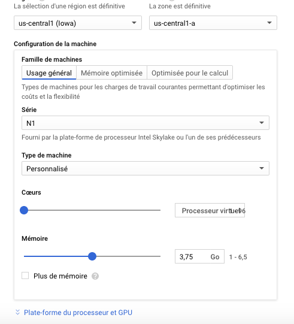
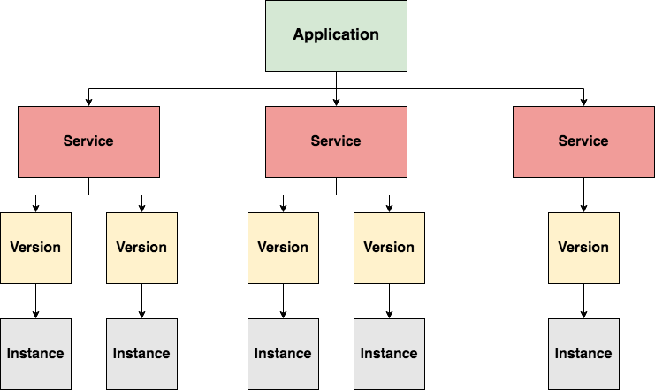

# Introduction au computing avec Google Cloud

L'objectif de ce chapitre est d'apprendre à plannifier et configurer des ressources de calcul GCP.
Nous verrons de manière pratiques quelques unes des ressources GCP et aussi quand les utiliser (par exemple dans le cas des machines virtuelles préemptibles, nous verrons comment ces dernières peuvent influencer les coûts de nos projets).

## Service Compute Engine (GCE)

Compute Engine est un service GCP fournissant des machines virtuelles. Nous appelerons généralement `instance`, une machine virtuelle en cours d'exécution.

1. Images de machines virtuelles

    * Les instance de VM exécutent des images contenant
        * Système d'exploitation
        * Librairies
        * Autres codes
    * GCP fourni un ensemble d'images Windows et linux
    * GCP permet aussi d'utiliser des images fournies par des projets OpenSource
    * GCP vous donne enfin la possibilité de créer des images personnalisées
    * Pour créer une image personalisée :
        * Créez une instance de VM
        * Effectuez des modifications en installant des programmes et en faisant des configurations spécifiques
        * Créez une image de votre VM via le lien `Images` du menu principal GCP (L'image sera créee à partir du disque de Boot de votre instance)
    * Il est possible de créer une image à partir :
        * d'un disque de boot de VM
        * d'un instantanné de VM
        * d'une autre image
        * d'un disque VMWare (VMDK) ou VHD (Virtual Hard Disk)
    * Les images personnalisées sont principalement utiles lorsque nous voulons créer plusieurs machines virtuelles personnalisées avec des logiciels spécifiques et des configurations. Nous pouvons donc créer une images préconfigurées et utiliser cette image afin de créer nos instances de VMs
    * GCP donne aussi la possibilité de réutiliser une image déjà existante dans votre DataCenter OnPremise. Pour cela, vous pourrez importer cette image en utilisant l'outil Virtual Disk Import fourni par GCloud.

2. Les machines virtuelles sont contenu dans des projets

    * Toute machine virtuelle est créee dans un projet (qui est en le noeud opérationnel d'une hiérarchie de ressources GCP)

3. Localisation des machines virtuelle : Région et Zones

    * Toute machine virtuelle est créee dans une Zone qui elle-même se situe dans une région
    * Une zone GCP représente de manière pratique un Datacenter physique GCP
    * Une région est une zone géographique (asia-east1, europe-west2, etc...) contenant une ou plusieurs zones (Datacenters)
    * Les zones d'une même régions sont reliées par une connexion réseau à très faible latence
    * D'autres facteurs peuvent entrer en ligne de compte lorsque vous décidez de créer une VM
        * Les coûts des VM peuvent varier d'une région à une autre
        * La règlementation sur la gestion des données peut être différente d'une région à une autre (par exemple la règlementation sur le stockage de données des citoyens de l'Union Européenne)
        * La disponibilité d'options de composants matériels n'est pas la même ente deux zones ou deux régions. En effet, en europe de l'ouest par exemple, on pourrait avoir la possibilité de créer des VMs avec des processeurs Intel Xeon E5, non disponibles en zone
        * La haute disponibilité des instances dans plusieurs zones/régions, qui permettra de maintenir un service disponible même dans le cas d'un problème dans une zone donnée
        * La latence d'accès aux services, qui permettra de réduire les temps d'accès aux services même dans le cas d'utilisateurs disséminés sur le globe.

4. Sécurisation des fonctions de création de machines virtuelles

    * Pour créer des ressource GCE, un utilisateur doit appartenir au projet et avoir des permission spécifiques lui permettant de le faire.
    * Pour associer un utilisateur à un projet on peut
        * associer l'utilisateur au projet de manière individuelle
        * associer le groupe de l'utilisateur au projet
        * associer le domaine G-Suite de l'utilisateur au projet
        * associer le compte de service de l'utilisateur au projet
    * Une fois que l'utilisateur est associé au projet, il devient possible de lui attribuer des rôles. Il est toutefois conseillé d'utiliser des rôles prédéfinis (par GCP), parce qu'ils sont construit de manière à regrouper un ensemble de permissions cohérentes permettant à un utilisateur d'effectuer toutes les tâches liées à ce rôle. Comme par exemple :
        * `Compute Engine Admin`, qui donne à l'utilisateur un contrôle total sur les instance GCE
        * `Compute Engine Network Admin`, qui donne à l'utilisateur la possibilité de créer, modifier et supprimer un ensemble de ressources réseau, ainsi que la possibilite d'accès en lecture au règles Firewall et certificats SSL. Toutegois, il n'a pas la possibilité de créer, modifier ou supprimer des instances de VMs
        * `Compute engine Security Admin`, qui donne la possibilité de créer, modifier et supprimer des certificats SSL et des règles Firewall
        * `Compute Engine Viewer`, qui permet de lister des ressources GCE sans avoir la possibilité de consulter leurs données.
    * Les permissions attribuées à un utilisateur au niveau `Projet` s'appliquent à toutes les ressources du projet. Par exemple, lorsque nous attribuons le rôle de `Compute Engine Admin` à un utilisateur au niveau `Projet`, alors cet utilisateur peut administrer toutes les les instances `Computes Engine` du projet.
    * Il et aussi possible de donner des permissions aux utilisateurs directement au niveau de la ressource, dans ce cas, l'utilisateur n'aura les droits que sur cette ressource.

5. Machines virtuelles Préemptibles (Suspendables en cas de forte demande d'infra)

    * Les instances de VM préemptibles sont des VMs disposant d'une durée de vie courte (généralement un maximum de 24H)
    * L'utilisation de ce type d'instance peut être envisagé :
        * dans le cadre de l'exécution de tâches dont la charge ne nécessite pas de haute disponibilité
        * dans le cadre d'une application tolérante aux pannes qui peut accepter des interruptions avec plus ou moins 30 secondes d'avertissement
        * Dans le cadre de processus de Ci/Cd, exécutés sur des noeuds esclave crées dynamiquement et détruite après le pipeline (Le plugin Jenkins [`Compute Engine Plugin`](https://plugins.jenkins.io/google-compute-engine) a été développé pour ce besoin)
        * Dans le cadre de tâches de backups et restauration
        * Dans le cadre de jobs d'analyse de données Big Data s'exécutant sur des clusters de serveurs exécutant Hadoop et Spark. Si des serveurs deviennent indisponibles, la plateforme logicielle (Hadoop/Spark) va le détecter et réorienter la charge vers les autres noeud du cluster. Il est donc possible de créer un Cluster avec des VMs garanties et des VMs Préemptibles pour réduire les coûts du Cluster tout en garantissant l'exécution des Jobs
        * etc...
    * Les VMs Préemptible réduiront fortement les coûts GCP.
    * Les limitations des VMs préemptibles sont les suivantes :
        * Elles peuvent être arrêtées à tout moment. Si elle sont arrêtées avant 10 minutes, vous ne serrez pas facturés
        * Elles ont une durée de vie d'un maximum de 24H
        * Elles ne sont pas disponibles tout le temps (En effet ce sont des VMs crées sur la base de ressources inexploitées de GCP)
        * Elles ne peuvent pas être migrées vers des machines virtuelles classiques
        * Elles ne peuvent pas être configurées pour être redémarrées automatiquement
        * Elles ne sont couvertes par aucune SLA

6. Type de machines personalisés

    * Compute Engine dispose de plus de 25 types de VM prédéfinies organisées en plusieurs groupes (Ratio 1 vCPU pour 3,75 Go RAM)
        * Standard
            * n1-standard-1, dispose d'un vCPUs et 3,75 Go de RAM
            * n1-standard-32, dispose de 32 vCPUs et 120 Go de RAM
        * Coeur partagés
            * g1-small, dispose d'un vCPU et 1,7 Go de RAM
        * Haute capacité mémoire
            * n1-highmem-32, dispose de 32 vCPUs et 208 Go de RAM (Ration de 1 vCPU pour 6,5 Go RAM)
        * Haute capacité processeur
            * n1-highcpu-32, dispose de 32 vCPUs et 28,8 Go de RAM
        * Mémoire optimisée
            * m1-megamem-96, dispose de 96 vCPUs et 1,4 To RAM
            * m1-ultramem-40, dispose de 40 vCPUs et 961 Go RAM
        * Optimisée pour le calcul
            * c2-standard-60, dispose de 60 vCPUs et 240 Go RAM

    * Dans le cas où les types de machines prédéfinies ne satisfont pas vos besoins, vous pouvez créer des types personnalisés de VMs afin de vous assurer une configuration sur mesure pour vos instances. Pour créer un type de machine
        * Lors de la création de la machine virtuelle, choisissez le type `Personalisé`
        * Dans le panneau qui s'affichera, remplissez les informations attendues
        * Vous pouvez aller jusqu'à 96 vCPUs et 624 Go RAM
    

7. Cas d'usage des machines virtuelle Compute Engine (GCE)

    * Compute Engine est recommendé lorsqu'on a besoin d'un contrôle avancé sur les instances  de VM. GCE permet notament :
        * de choisir les images à exécuter sur nos VMs
        * d'installer des applications et librairies personalisés
        * d'avoir un contrôle avancé sur les permissions d'accès aux VMs
        * d'avoir le contrôle sur les certificats SSL et les règles de parefeu

## Service AppEngine

1. Contexte
    * `AppEngine` est l'offre PaaS de GCP
    * `AppEngine` fournit une plateforme managée de déploiement d'applications
    * Avec `AppEngine`, l'utilisateur se concentre sur les besoins de ses applications et non sur la création et l'administration des VMs.
    * Avec `AppEngine`, au lieu de créer, configurer et administrer des VMs, l'utilisateur se spécifie juste les besoins en ressources de son application, ainsi que les élements de déploiement. GCP s'occupe de la gestion des ressources et de leur allocation à l'application

2. Structure d'une application `AppEngine`

    * Une `Application` `AppEngine` est constituée d'un ensemble de `Service`
    * Un `Service` `AppEngine` est une entité offrant une fonctionnalité spécifique comme par exemple
        * Le calcul d'une taxe dans une application web
        * La mise à jour de l'inventaire de stock d'un produit sur un site
    * Chaque `Service` a une `Version`, ce qui permet de faire cohabiter plusieurs version d'un même service
    * Chaque version est implémentée par une `Instance` du `Service`, géré par `AppEngine`
    * Le nombre d'instances utilisées pour supporter les services de l'application `AppEngine` dépend entièrement de votre configuration et de vos besoins. En fonction de la charge, GCP peut rajouter ou supprimer des instances afin d'optimiser les coûts sur des instances non utilisées. On parle donc de Dynamic Scaling (ou Auto Scaling)
    * Lorsque le nombre d'instance varie beaucoup, il peut devenir assez difficile de suivre et estimer les coûts et les limites de budgets à ne pas dépasser. Afin d'adresser cette problématique, GCP permet de mettre en place des limites journalières de dépenses, ainsi que des Budgets et des Alarmes.

    

3. Environnement standard et flexible de AppEngine

    * `AppEngine` propose deux types d'environnements d'exécution d'application
        * `AppEngine Standard Environment`
        * `AppEngine Flexible Environment`
    * `AppEngine Standard Environment`
        * Environnement original de `AppEngine`
        * Environnement préconfiguré avec des langages spécifiques
        * Supprime les instances s'il y a pas de charges de travail
        * `AppEngine` dispose de deux génération pour ce type d'environnement
            * `Première Génération`, mettant à disposition les langages
                * `Python 2.7`
                * `PHP 5.5`
                * `Go 1.9`
            * `Deuxième Génération`, mettant à disposition les langages
                * `Java 8`
                * `Python 3.7 (beta)`
                * `PHP 7.2 (beta)`
                * `Node.js 8 (beta) et 10 (beta)`
                * `Gi 1.11 (beta)`
        * La deuxième génération de l'environnement standard de `AppEngine` permet d'utiliser n'importe quel langage, tandis que la première limite les choix à un ensemble de langages autorisés.
        * L'accès réseau est resetreint dans la première génération tandis qu'elle est possible dans la deuxième génération
        * 
    * `AppEngine Flexible Environment`
        * Fournit un environnement offrant plus d'options et de contrôle aux développeurs qui veulent tirer parti de `AppEngine`
        * Supprime les contraintes de limitation de langages et de personalisation
        * Utilise les conteneurs comme block de base de construction d'applications, permettant ainsi aux utilisateurs de configurer l'environnement d'exécution de leur application via la personalisation du conteneur qui la fera tourner.
        * Les utilisateurs familier aux `Dockerfiles` peuvent donc spécifier les OS voulus, ainsi que les langages et bibliothèques nécessaires à l'exécution de leur application dans le conteneur (Java, PHP, Node.js, Go, Python, .Net, etc...)
        * `AppEngine` fournit en réalité un PaaS managé et se présente comme une très bonne option lorsque vous avez la possibilité de packager vos applications sous forme d'un ensemble de petits containers.
        * L'ensemble des conteneurs constituant votre application pourront donc être scalés en fonction de la charge (Par exemple, si la charge processeur des conteneurs est supérieu à un seuil).
        * Avec `AppEngine` l'etat de santé des serveurs sur lesquels tournent vos services est géré et garanti directement par GCP, sans aucune intervention de la part de l'utilisateur (`Serverless`)

4. Cas d'usage de AppEngine

    * `AppEngine` est conseillé lorsque vous voulez déployer des services applicatifs sans vous soucier de l'infrastructure sous-jacente (`AppEngine` va gérer, administrer et monitorer pour vous les VMs et conteneurs sous-jacents)
    * `AppEngine (environnement standard)` est conseillé lorsque vous souhatez exécuter des services écrit dans un des langages supportés par la plateforme, ainsi que les contraintes qui l'accompagnent
    * `AppEngine (environnement flexible)` est conseillé pour des applications pouvant être décomposées en services, chacun packagés dans des conteneurs (la personalisation de vos conteneur se faisant essentiellement dans vos Dockerfiles).

## Service Kubernetes Engine (GKE)

`GCE` donne la possibilité decréer et gérer des VMs de manière individuelle ou groupées (Instances Group). Vous pouvez donc ainsi personaliser les outils et bibliothèques de vos VMs de manière individuelle ou groupée et y déployer des applications.

Malheureusement, les application modernes sont très soouvent packagées sous forme d'un ensemble de services (microservices), chacun nécessitant une configuration matérielles, des dépendances logicielles et des contraintes d'échelle (scaling) différents. Adresser ce type de déploiement avec des VMs `GCE` devient très vite impossible à gérer et maintenir.

Le service `GKE (Google Kubernetes Engine)` permet de gérer ce type de cas.

1. Définitions
    * `GKE` est un service fournissant aux utilisateurs une plateforme `Kubernetes` managée par `Google`
    * `Kubernetes` est un outils `Open Source` crée par `Google` dans le but d'automatiser l'administration d'un cluster de machines virtuelles ou physiques.
    * `Kubernetes` est connu come étant un `Orchestrateur` de conteneurs
    * `Kubernetes` est conçu pour gérer et piloter l'exécution de plusieurs application sur un cluster de machines (VMs ou Physique)
    * `Kubernetes` est différents des application intégrant un mécanisme interne de haute disponibilité et qui sont capable de s'exécuter elle-même sur un ensemble de serveurs (Hadoop, Spark, Elasticsearch, MongoDB, etc...)
    * `GKE` est donc un service `GCP` permettant
        * De créer, modifier, supprimer des clusters `Kubernetes`
        * De déployer des qpplications contenrurisées
        * Administrer des clusters `Kubernetes`
        * Gérer des politiques de scaling des noeuds des clusters `Kubernetes`
        * Monitorer des clusters `Kubernetes`

2. Fonctionnalités de `GKE`

    * La répartition de charge entre les VMs `GCE` du cluster `Kubernetes` sous-jacent
    * L'auto-scaling (Up et Down scaling) vertical des noeuds constituant un cluster `K8S`
    * La mise à jour automatique des logiciels des noeuds du Cluster
    * Le monitoring et la réparation automatique des noeuds du cluster
    * Le support des pools de noeuds, représentant des noeuds ayant la même configuration
    * La journalisation

3. Architecture de Kubernetes

    * Un cluster `Kubernetes` est constitué d'un ou plusieurs noeud `MASTER` et un ou plusieurs noeuds `WORKER`, on parle aussi de `MASTER` pour désigner un noeud `MASTER` et de `NODE` pour désigner un noeud `WORKER`
    * Les noeuds `MASTER` permettent de fournir les service structurels et d'administration du cluster via des services tels que :
        * `API Server`
        * `Resources Controller`
        * `Scheduler`
        * etc...
    * `API Server` est une API exposant toutes les fonctionnalités permettant la communication avec le cluster
    * Lorsqu'un cludter `GKE` est crée (via la console ou en ligne de commande), un ensemble de noeuds (VMs `GCE`) est crée avec, format ainsi la grappe de serveurs du cluster
    * Le type par défaut des VMs du cluster `GKE` est `n1-standard-1`, mais un ensemble d'options sont disponibles afin de personaliser la construction d'un cluster `GKE`
    * `Kubernetes` déploie les conteneurs dans des groups nommés `PODS`
    * Le `POD` est l'unité de base d'un déploiement Kubernetes
    * Tous les conteneurs d'un même `POD` partagent
        * La même adresse IP
        * Le même espace de port
        * Le même espace de stockage
        * Les même ressources réseau
    * Les conteneurs d'un `POD` sont déployés et scalé comme une seule unité
    * Une partie des ressources de chaque noeud est réservée à l'exécution de `Kubernetes`
        * Concernant la RAM
            * 25% des premier 4GB de RAM (Si vous avez 4GB de RAM `kubernetes` utilisera 1GB pour son exécution)
            * 20% des prochains 4GB de RAM (Si vous avez 8GB de RAM `kubernetes` utilisera 1,8GB pour son exécution 25% des premier 4GB = 1GB et 20% des second 4GB = 0,8GB)
            * 10% des 8GB suivants Si vous avez 16GB de RAM `kubernetes` utilisera 2,6GB pour son exécution 25% des premiers 4GB = 1GB, 20% des second 4GB = 0,8GB et 10% des 8GB suivants = 0,8)
            * 6% des prochains 112GB
            * 2% de toute mémoire au dessus de 128GB
        * Concernant les vCPUs
            * 6% du premier coeur
            * 1% du deuxième coeur
            * 0,5%  des deux coeurs suivants
            * 0,25% de tous coeurs au delà de 4

4. Haute disponibilité Kubernetes

    * Une manière pour `Kubernetes` d'assurer la consomation correcte des ressources est de tuer les processus qui commecent à devenir gourmand
    * `Kubernetes` supporte les processus d'éviction, basés sur les seuils de ressources. ce processus permet d'assurer la stabilité des PODs dans un environnement à ressources limitées. Il permet à `Kubernetes` de killer les POD qui sont en dépassement de ressources seuil.
    * Kubernetes est le bon choix pour des déploiements à grande échelle d'application contenerisées nécessitant de la haute disponibilité, reliabilité.
    * Kubernetes supporte entre autres les concepts de `POD` et `DEPLOYMENT`, particulièrement utiles pour la planification des déploiements d'applications constituées de microservices ayant des besoins et des contraintes de déploiements différents

## Service Cloud Functions (GCF)

1. Environnement d'exécution de fonctions cloud

    * `Cloud Functions` est une plateforme d'exécution `Serverless` conçue pour l'exécution `One-Shot` de code en réponse à un évènement donné survenu dans l'environnement `GCP`.
    * `Cloud Functions` ne nécessite aucu provisionning de VMs, Clusters ou containers
    * `Cloud Functions` exécute des fonctions écrite en
        * `Go (1.11, 1.13)`
        * `Java 11`
        * `Node.js (6, 8, 10, 12)`
        * `Python (3.7, 3.8)`
    * `Clouf Functions` est une plateforme d'intermédiation entre services indépendants 
        * Par exemple, un service qui crée et enregistre un fichier dans un Bucket Google Storage et un autre service exécutant un traitement sur un fichier. Ces deux services peuvent être développés séparément et utiliser une fonction `Cloud Function` pour déclencher le traitement du fichier aussitot qu'il est enregistré
    * `GCP` va prendre en charge tout ce qui est nécessaire à l'exécution d'une fonction `Cloud Function`, car en effet, derrière le terme `Serverless` se cache des serveurs virtuels ou physiques qui exécutent notre code, mais l'utilisateur n'a pas à s'en préocuper
    * Les points clés à retenir sur `Cloud Functions`
        * Les fonctions s'exécutent dans un environnement sécurisé et isolé
        * Les ressources de calcul scalent automatiquement en fonction de la configuration des instances de fonctions à exécuter
        * Les exécutions des fonctions sont indépendantes les unes des autres
    * Les conséquences de ces points sont les suivants
        * Plusieurs instances de la même fonction peuvent s'exécuter en même temps
        * Il est assez difficile de gérer les conflits d'exécution de deux instances de la même fonction
            * Par exemple, si deux utilisateurs enregistrent simultanément deux fichier dans `Cloud Storage`, deux instance de la fonction en charge des traitements de fichier vont être déclenchées et s'exécuteront en concurrence.
        * Les instances de fonction cloud sont `STATELESS`
        * `Cloud Functions` propose un mécanisme permettant de rendre l'exécution de fonctions cloud `STATEFUL`

2. Cas d'usage de fonctions cloud

    * `Cloud Functions` est utilisé en particulier dans le traitement des évènements
    * `Cloud Functions` permettra donc de chaîner les traitements de services sur la base d'évènements

## Résumé

## Quelques questions d'examen

## Revue des questions
