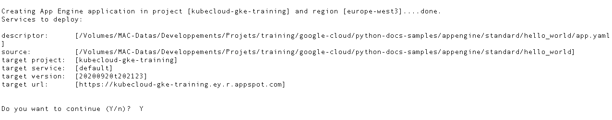

# Computing avec le service AppEngine

Ce chapitre présente le déploiement d'une application AppEngine.

* Présentation de la structure d'une Application AppEngine
* Présentation de la configuration d'une application AppEngine
* Présentation du tuning, du scaling et du versionning d'une application AppEngine

Google AppEngine a été conçu pour exécuter des applications sur des plateformes :

* Standards : Supportant des langages spécifiques
* Flexibles : Supportant des container (qui embarquent leur environnement d'exécution)

Dans ce chapitre, nous mettrons l'accent sur les applications AppEngine Standards

## Composants du service AppEngine

Une application App Engine est constituée de 4 composants :

1. `Application`

    * représente une ressource de haut niveau crée dans un projet
    * un projet peut disposer s'une application
    * toutes les ressources associées à une application App Engine sont crées dans la même région que celle spécifiée lors de la création de l'Application AppEngine

2. `Service`

    * Représente le code exécuté par l'application App Engine
    * Définit par un code source et des fichiers de configuration
    * Une Application App Engine dispose au minimum d'un service
    * Un service est structuré afin de générer une fonction spécifique (Microservice), par exemple
        * Gérer des requêtes d'accès aux données via une API
        * Gérer l'authentification
        * Enregistrer des données pour la facturation

3. `Version`

    * Représente la version du service exécuté
    * Plusieurs version du code du service peuvent exister et sont différentiés par une version
    * Le stockage de plusieurs version d'une application App Engine offre des avantages :
        * La possibilité de tester les features d'une nouvelle version sur un nombre restreint d'utilisateurs avant la mettre à disposition de tous les utilisateurs
        * La possibilité de rollback à une version antérieure stable en cas de problème sur une version supérieure
        * La possibilité de migrer d'une version à une autre via le Split de traffic
    * Pratiquement une version est la combinaison d'un code source de service et l'ensemble de ses fichiers de configuration. Si vous modifier l'un des deux, vous créez une nouvelle version de l'application App Engine

4. `Instance`

    * Représente l'exécution d'une version donnée d'un service App Engine


## Déploiement d'une application AppEngine

Il n'est pas attendu d'un Cloud Engeneer de savoir écrire des applications App Engine, mais de savoir les déployer. Pour notre cas, nous nous servirons d'une application App Engine Standard existante écrite en python. Pour cela, nous installerons d'abord sur notre Cloud SDK, le composant Python de App Engine

1. Déploiement d'application AppEngine via Cloud SDK et Cloud Shell

    * Installation du composant Python our App Engine : `gcloud components install app-engine-python`
    * Cloner le dépot de source d'exemple sur github : `git clone https://github.com/GoogleCloudPlatform/python-docs-samples`
    * Dans le répertoire pythos-docs-samples/appengine/hellowold nous avons les fichiers
        * `app.yaml`, qui représente le descripteur de déploiement de l'application App Engine.
            * `runtime` permet de préciser la plateforme AppEngine à utiliser (`python27`)
            * `api_version` permet de préciser la version de l'API que vous déployez
            * `threadsafe` est un paramètre python
            * `handlers` permet de définir les scripts qui prendront en charge le traitement des appels sur les URL dont le pattern est défini

        ```
        runtime: python27
        api_version: 1
        threadsafe: true
        
        handlers:
        - url: /.*
          script: main.app
        
        ```

        * `main.py`, rerésente le script Python qui implémente le traitement du service. Il est utilisé dans le descripteur de déploiement pour la configuration des Handlers
        * `main_test.py`, représente le fichier de test du service.

    * Pour déployer ce service
        * `gcloud app deploy app.yaml [--project <PROJECT_ID>] [--version <VERSION>] [--no-promote]`
            * `PROJECT_ID` représente l'identifiant du projet dans lequel vous souhaitez déployer votre Aplication App Engine
            * `VERSION` représente la version de l'application App Engine
            * `--no-promote` permet de ne pas rediriger les flux vers cette instance de l'application (on peut donc déployer une instance sans permettre son accès)

        Cette commande vous demandera
        * de choisir la region de déploiement de l'application

        

        * de a valider les informations de déploiement de votre application

        

        * Une fois l'application déployée, vous pouvez la démarrer dans le navigateur
            * via la commande : `gcloud app browse`
            * via la console Cloud Console/App Engine/Service

            

        * Vous pouvez voir les version du service
            * via la commande : `gcloud app versions list`
            * via la console Cloud Console/App Engine/Versions

        * Vous pouvez voir les services App Engine
            * via la commande : `gcloud app services list`
            * via la console Cloud Console/App Engine/Services

        * Vous pouvez voir les instances de services App Engine
            * via la commande : `gcloud app instances list`
            * via la console Cloud Console/App Engine/Instances

        * Vous pouvez arrêter une liste de versions d'instances :
            * via la commande `gcloud app versions stop v1 v2 v3 ...`

        * Vous pouvez désactiver une application via le menu `parametres`. Les ressources associées à cette application seront shutdown et vous pourrez la réaciver plus tard

        * Il est impossible de supprimer l'application APp Engine par défaut

## Scaling d'applications AppEngine

1. App Engine peut scaler automatiquement l'application sur la base de la charge.
2. Lorsque l'application AppEngine est scalée en fonction de la charge, on parle d'instances dynamiques.
3. Il est aussi possible de configurer les instances de services AppEngine de manière à ce qu'elles soient résidentes et permanentes. Cette configuration permet d'améliorer l'expérience utilisateur qui n'attendra pas le temps de démarrage d'une instance.
4. Votre configuration détermine si votre application est résidente ou dynamique. Lorsque vous utilisez l'auto-scaling ou le scaling basique, vos instances sont de fait dynamiques. Lorsque vous configurez le scaling manuel, vos instances sont résidentes
5. Pour configurer l'auto-scaling dans votre application, rajoutez une section dans le descripteur de déploiement contenant : `automatic_scaling`, contenant les clés-valeur suivantes :
    * `target_cpu_utilization`, qui permet de préciser le pourcentage maximum d'utilisation CPU entrainant le démarrage d'une nouvelle instance du service
    * `target_throughput_utilization`, percentage value, between 0,5 and 0,95 utilisée pour déterminer le moment où une nouvelle instance doit créee. Lorsque le nombre simultanné de requêtes sur une instance atteint la valeur de `max_concurrent_requests * target_throughput_utilization`, une ouvelle instance est démarrée
    * `max_concurrent_requests`, représente le nombre maximum de base de requêtes simultannées que peut supporter une instance avant le démarrage d'une nouvelle instance. La valeur par défaut est 10 et la valeur max est 80
    * `max_instances`, représente le nombre maximum d'instances simultannées de ce service
    * `min_instances`, représente le nombre minimum d'instances simultannées de ce service
    * `max_pending_latency`, représente la durée maximale d'attente d'une requête dans la file avant d'êre traitée
    * `min_pending_latency`, représente la durée miniimale d'attente d'une requête dans la file avant d'êre traitée

    ```
    runtime: python27
    api_version: 1
    threadsafe: true
    
    handlers:
      - url: /.*
        script: main.app
    
    automatic_scaling:
      target_cpu_utilization: 0.65
      max_instances: 5
      min_instances: 3
      max_pending_latency: automatic
      min_pending_latency: 30ms
      max_concurrent_requests: 50
    ```

   * Vous pouvez aussi configurer l'autoscaling basique, qui se configure avec deux paramètre
        * `max_instances`, représente le nombre maximum d'instances que App Engine peut créer pour cette version du service
        * `idle_timeout`, qui représente la durée d'inactivité d'une instance conduisant à sa suppression par App Engine

    ```
    runtime: python27
    api_version: 1
    threadsafe: true
    
    handlers:
      - url: /.*
        script: main.app
    
    basic_scaling:
      idle_timeout: 20m
      max_instances: 10
    ```

    * Vous pouvez aussi configurer le scaling manuel et préciser le nombre d'instance du service
        * `instances`, permet de définir le nombre d'instances du service à créer

    ```
    runtime: python27
    api_version: 1
    threadsafe: true
    
    handlers:
      - url: /.*
        script: main.app
    
    manual_scaling:
      instances: 7
    ```

## Gestion du traffic entre applications AppEngine

## Résumé

## Quelques questions d'examen

## Revue des questions
