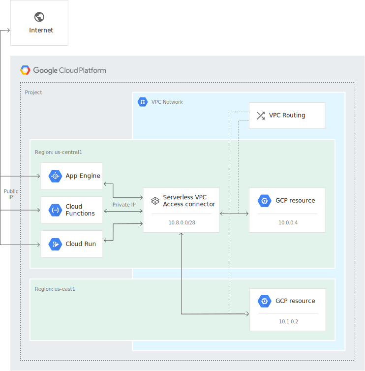
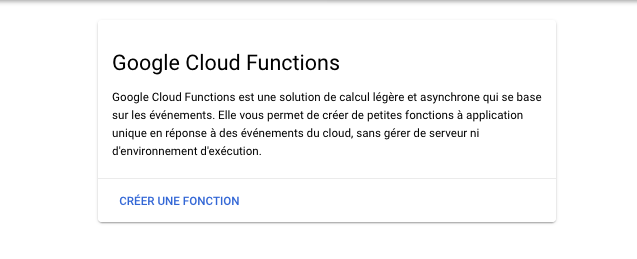
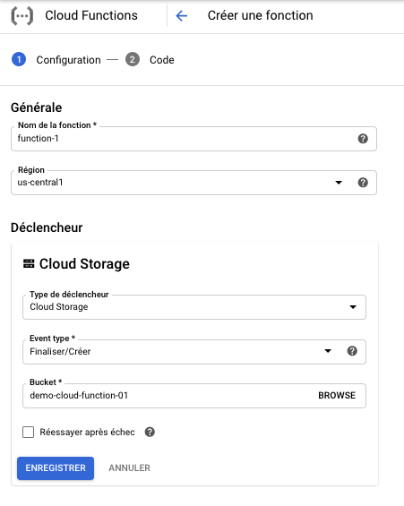
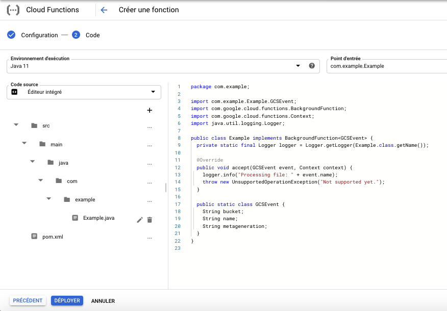

# Computing avec le service Cloud Functions (GCF)

Dans ce chapitre nous aborderons la notion de Cloud Function, nous verrons ce aue c'est qu'une Cloud Function ainsi que les cas où il est interessant de les utiliser. Nous verrons ensuite comment mettre en place et déployer une Cloud Function.

## Introduction au service Cloud Functions

0. Présentation

    * `Cloud Function` est (Tout comme `App Engine`) un service de calcul Serverles fournit par GCP.
    * `Cloud Function` diffère de `App Engine` sur certains points :
        * `App Engine` supporte plusieurs service organisés dans la même application `App Engine`, tandis que Cloud Function supporte le modèle de déploiement et de gestion individuelle et indépendant des services.
        * `App Engine` est conseillé pour des traitements continus :
            * Des applications web avec des Front End
            * Des API  exposés via des services
            * Des services avec de la logique métier
        * `Cloud Function` est utilisé pour le traitement d'évènements ponctuels
            * Le traiement d'un fichier uploadé sur Cloud Storage
            * Le traitement d'un message survenue sur Cloud Pub/Sub
    * `Cloud Function` impose des limites
        * Le temps d'exécution d'une fonction est de 1mn max par défaut, mais il est possible de le configurer jusqu'à 9 minutes

1. Évènements, Déclencheurs et Fonctions

    * Les `Évènements` sont des actions particulières qui surviennent dans Googe Cloud, comme par exemple :
        * Un fichier uploadé sur Cloud Storage
        * Un message posté sur un topic Pub/Sub
        * Un appel HTTP (GET, POST, PUT, DELETE, OPTIONS)
        * Des évènements déclenchés par des triggers sur une base de données Firebase
            * Triggers de base de données
            * Triggers de condifuration distante
            * Triggers d'authentification
        * Inscription d'une nouvelle entrée dans les Logs StackDriver
            * On peut ainsi configurer une fonction `Cloud Function` permettant de forwarder la nouvelle entrée dans un Topic Pub/Sub
    * Le déclencieur est la confiruration pour une Cloud Function donnée des évènement qui consuisent à son exécution.

2. Environnements d'exécution

    * Une instance de `Cloud Function` d'exécute dans son propre environnement.
    * Chaque fois que la fonction est déclenchée elle est exécutée sur une instance individuelle.
    * Chaque instance de `Cloud Function` est donc sans état.
    * Si nous souhaitons partager des données entre plusieurs instances d'une `Cloud Function`, il faudra utiliser un composant partagé par exemple :
        * Une base de donnée `Cloud Datastore`
        * Un fichier `Cloud Storage`
        * Un cache de donnée `Cloud Memorystore`
        * etc..
    * `Cloud Function` supporte plusieurs environnements d'exécution
        * Python (3.7, 3.8 en Bêta)
        * Node.js (6, 8) obsolete, (10, 12 en Bêta)
        * Java 11
        * Go (1.11, 1.13)
    * Voici un exemple de fonction `Cloud Function` qui traite un évènement d'upload de fichier `Cloud Storage`

    `PYTHON`
    ```
    def cloud_storage_function_test(event_data, event_context):
        print('Event ID: {}'.format(event_context.event_id))
        print('Event type: {}'.format(event_context.event_type))
        print('File: {}'.format(event_data['name']))
    ```

    `JAVA`
    ```
    // Cloud Function - EntryPoint
    
    package functions;
    
    import com.google.cloud.functions.BackgroundFunction;
    import com.google.cloud.functions.Context;
    import functions.eventpojos.GcsEvent;
    import java.util.logging.Logger;
    
    public class HelloGcs implements BackgroundFunction<GcsEvent> {
      private static final Logger logger = Logger.getLogger(HelloGcs.class.getName());
    
      @Override
      public void accept(GcsEvent event, Context context) {
        logger.info("Event: " + context.eventId());
        logger.info("Event Type: " + context.eventType());
        logger.info("Bucket: " + event.getBucket());
        logger.info("File: " + event.getName());
        logger.info("Metageneration: " + event.getMetageneration());
        logger.info("Created: " + event.getTimeCreated());
        logger.info("Updated: " + event.getUpdated());
      }
    }

    // Cloud Function Event Definition (JSON Field)
    package functions.eventpojos;
    
    import java.util.Date;
    
    public class GcsEvent {
      // Cloud Functions uses GSON to populate this object.
      // Field types/names are specified by Cloud Functions
      // Changing them may break your code!
      private String bucket;
      private String name;
      private String metageneration;
      private Date timeCreated;
      private Date updated;
    
      public String getBucket() {
        return bucket;
      }
    
      public void setBucket(String bucket) {
        this.bucket = bucket;
      }
    
      public String getName() {
        return name;
      }
    
      public void setName(String name) {
        this.name = name;
      }
    
      public String getMetageneration() {
        return metageneration;
      }
    
      public void setMetageneration(String metageneration) {
        this.metageneration = metageneration;
      }
    
      public Date getTimeCreated() {
        return timeCreated;
      }
    
      public void setTimeCreated(Date timeCreated) {
        this.timeCreated = timeCreated;
      }
    
      public Date getUpdated() {
        return updated;
      }
    
      public void setUpdated(Date updated) {
        this.updated = updated;
      }
    }
    
    ```

## Commande gcloud permettant de déployer une Cloud Function

```
gcloud functions deploy (NAME : --region=REGION) [--allow-unauthenticated]
        [--egress-settings=EGRESS_SETTINGS] [--entry-point=ENTRY_POINT]
        [--ignore-file=IGNORE_FILE] [--ingress-settings=INGRESS_SETTINGS]
        [--memory=MEMORY] [--retry] [--runtime=RUNTIME]
        [--service-account=SERVICE_ACCOUNT] [--source=SOURCE]
        [--stage-bucket=STAGE_BUCKET] [--timeout=TIMEOUT]
```

* `NAME`, permet de préciser le nom de la fonction
* `--region=REGION`, permet de préciser la région de déploiement de la fonction
* `--allow-unauthenticated`, permet de préciser si un utilisateur non authentifié peut invoquer la fonction (Permet de rendre un fonction full public)
* `--entry-point=ENTRYPOINT`, permet de préciser le nom de la classe ou de la fonction qui sera exécutée lorsque l'évènement sera déclenché
* `--memory=MEMORY`, permet de limiter la mémoire à allouer à cette fonction
* `--retry`, permet de demander la ré-exécution de la fonction en cas d'erreur
* `--runtime=RUNTIME`, permet de spécifier l'evironnement d'exécution à utiliser
    * nodejs10: Node.js 10
    * nodejs12: Node.js 12
    * python37: Python 3.7
    * python38: Python 3.8
    * go111: Go 1.11
    * go113: Go 1.13
    * java11: Java 11
    * nodejs6: Node.js 6 (deprecated)
    * nodejs8: Node.js 8 (deprecated)
* `--service-account=SERVICE_ACCOUNT`, permet de préciser l'adresse email du compte associé à l'exécution de la fonction Cloud. Ce compte détermine les droits de cette fonction lors de différents appels de service GCP. Si aucun compte n'est précisé, alors le compte par defaut du projet parent est utlisé
* `--source=SOURCE`, localisation du code de la fonction.
    * Si le chemin de la source commence par `gs://`, il sera interprté comme une adresse de bucket Cloud Storage
    * Si le chemin de la source commence par `https://`, il sera interprté comme une adresse de dépôt de source ur le gestionnaire de source Google (https://source.developers.google.com/projects/${PROJECT}/repos/${REPO})
    * Sinon, le chemin est considéré comme chemin local dans la machine à partir de laquelle la commande est exécutée
* `--stage-bucket=STAGE_BUCKET` est utilisé pour spécifier le bucket Cloud Storage à utiliser pour stocker le code de la fonction au cas où le chemin des sources est local
* `--timeout=TIMEOUT` permet de préciser la durée maximale d'exécution de la fonction
* `--vpc-connector=VPC_CONNECTOR` permet de spécifier le connecteur d'accès au VPC, permettant aux fonction (Cloud Function/App Engine/Cloud Run), d'accéder à des services s'exécutant sur Cloud Compute (Des service sur VM, des données Cloud MemoryStore, etc...). En effet par défaut les charges de travail s'exécutant sur des environnements `Serverless` n'ont pas accès aux services `Cloud Engine` tournat sur un reseau VPC. Pour qu'elles aient accès, il faut créer un connecteur d'accès faisant le pont entre les environnement Serverless et VPC.



* `--trigger-bucket=TRIGGER_BUCKET`, permet de préciser le bucket déclencheur de la fonction
* `--trigger-topic=TRIGGER_TOPIC`, permet de préciser le nom du topic Pub/Sub déclencheur de la fonction
* `--trigger-http` permet de préciser que lq fonction est déclenchée via un appel HTTP sur le endpoint associé à la fonction.
* `--trigger-event=EVENT_TYPE`, permet de préciser le type d'évènement déclencheur. La liste des types d'évènements peut être obtenu via `gcloud functions event-types list` (Colonne EVENT_TYPE)
* `--trigger-resource=RESOURCE`, permet de préciser la ressource à partir de laquelle l'évènement sera écouté. La liste des types de ressources peut être obtenu via `gcloud functions event-types list` (Colonne RESOURCE_TYPE)

## Réception d'évènements par une fonction Cloud Function depuis le service Cloud Storage

Cloud Storage est le service de stockage Objet de GCP. Il permet de stocker des fichiers dans des conteneurs appelés `Buckets`. Chaque fois qu'un fichier est créée, modifié ou supprimé, un évènement est levé, permettant ainsi de lancer un fonction `Cloud Function` associé à cet évènement.

1. Déploiement d'une fonction Cloud pour la gestion d'évènements issues du service Cloud Storage via la Console Web

    * Allez sur le menu `Cloud Function` proprosé par GCP

    

    * Dans la page principale de `Cloud Function`, Cliquez sur le bouton `Créer une Fonction`

    

    * Renseignez les paramètres de base (Nom, Région, Déclencheur) et avancés (Mémoire allouée, Nombre dinstances max, la durée maximale d'exécution [équivalente au activeDeadlineSeconds des Jobs Kubernetes]) de la fonction dans le formulaire

    

    * Renseignez les informations sur le code à exécuter (Plateforme [Java, Python, NodeJS, Go, etc..], Le point d'entrée de votre fonction, le code de votre fonction [Soit écrit en ligne, soit uploadé depuis votre machine ou depuis un bucket])

    

    * Uploader ensuite un fichier dans le Bucket surveillé par le trigger de la fonction et visualisez son exécution dans les journeaux.

2. Déploiement d'une fonction Cloud pour la gestion d'évènements issues du service Cloud Storage via Cloud SDK/GCloud

`gcloud functions deploy cloud_storage_function_test --runtime python37 --trigger-resource gcp-ace-exam-test-bucket --trigger-event google.storage.object.finalize`

## Réception d'évènements par une fonction Cloud Function depuis le service Cloud Pub/Sub

1. Déploiement d'une fonction Cloud pour la gestion d'évènements issues du service Cloud Pub/Sub via Cloud SDK/GCloud

`gcloud functions deploy pub_sub_function_test --runtime python37 --trigger-topic gcp-ace-exam-test-topic`

## Résumé

## Quelques questions d'examen

## Revue des questions
