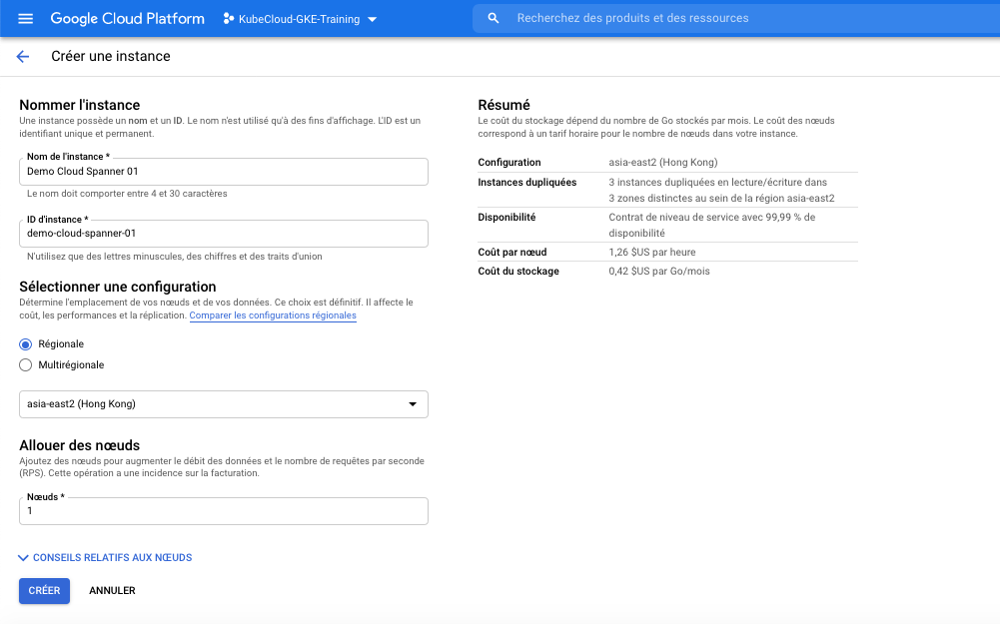
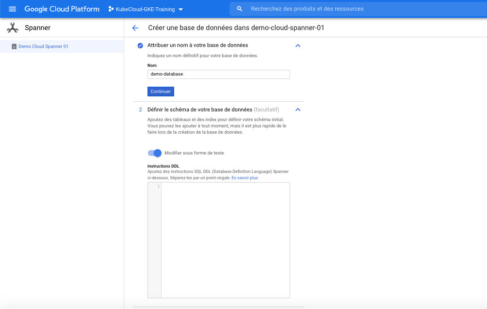
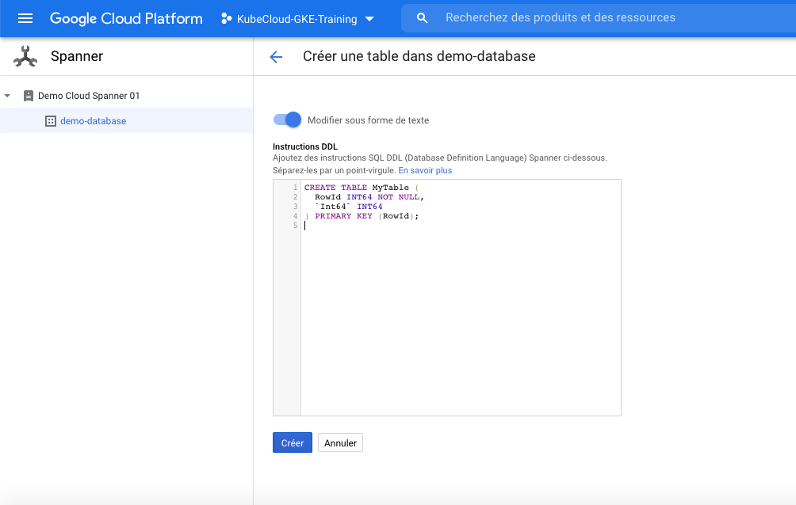
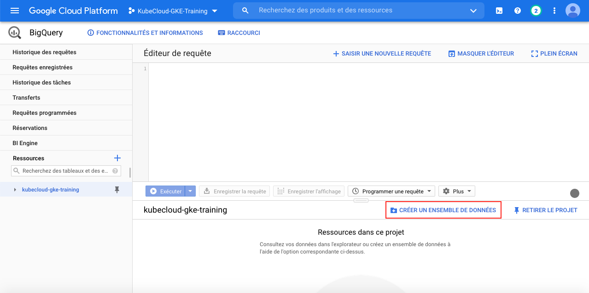
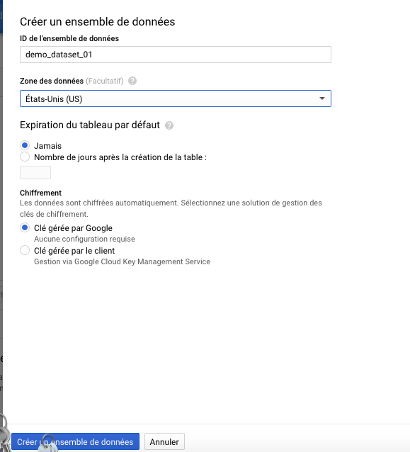

# Compréhension et plannification du stokage dans le Cloud

Dans ce chapitre, nous allons encore une fois plonger dans les concepts de stockage proposés par GCP dans le but de savoir comment choisir la bonne solution de stockage de données en fonction d'une situation et d'un besoin.

D'entrée de jeu, le choix d'une solution de stockage de données se fait sur la base de plusieurs critères :

* Le délais (latence) et la fréquence d'accès aux données
* Le modèle de données (Type, Structuration, etc...)
* Le support de transaction
* La disponibilité des données
* La consistence des données
* La durée du stockage des données

## Types de systèmes de stockage

Dans la majorité des cas, le choix de la solution de stockage dépends très souvent du délais d'accès à la donnée. Les temps d'accès varieront donc entre la nano-seconde (temps d'accès pour une données qui se trouve déjà sur le cache L1 du CPU) et les heures (temps que peut prendre un microservice pour récupérer un fichier)

Pour rappel

* Nanoseconde = 10E-9 seconde
* Microseconde = 10E-6 seconde
* Milliseconde = 10E-3 seconde

1. Cloud memorystore (Cache)

    * Entrepoôt de stockage de données en mémoire
    * Conçu pour fournir des accès très rapide (en moins d'une milliseconde) aux données
    * Limité en fonction de la taille de mémoire RAM disponible
    * Données perdues en cas de redémarrage du système
    * Utilisé spécifiquement pour stocker de faibles volumes de données fréquemment utilisés
    * Google MemoryStore
        * Service de cache en mémoire proposé par GCP
        * Basé sur les outils `Redis` et `Memcached`, des caches OpenSource largement utilisés
        * Permet de créer des instances `Redis/Memcached` disposant de 1GB à 300GB de mémoire RAM
        * Permet aussi de configurer `Redis/Memcached` en mode Haute disponibilité (Cluster de plusieurs instances)
        * Pour créer une instance de Cache MemoryStore (Redis) :
            * Allez sur le menu `MemoryStore` et cliquez sur le sous menu `Redis`
            * Si c'est votre première instance, il sera nécessaire d'activer l'API MemoryStore Redis
            * Renseignez l'ID et le nom de l'instance
            * Renseignez le niveau de disponibilité (instance unique (`Basique`) ou support de haute disponibilité (`Standard`))
            * Renseignez la région et la zone de création de votre/vos instance(s). Dans le cas d'un cluster, le chois de la zone `Toutes les zones` entrainera une distribution automatiques de vos instances dans les zones de la région choisie.
            * Renseignez la taille de la mémoire dédiée à chacune de vos instances
            * Renseignez la version de redis à déployer
            * Préciser des paramètres de configuration spécifiques à Redis (`activedefrag`, `memory-policy`, `ifu-decay-time`, `ifu-log-factor`, `notify-keyspace-events`)
            * Définissez le mécanisme réseau d'accès à vos instance `Redis`. En effet, GCP crée les instances `MemoryStore (Redis/Memcached)` sur un réseau VPC distinct et pour pouvoir y accéder depuis vos `VMs` ou depuis vos applications `EppEngine`, `Cloud Function` ou encore `Cloud Run`, il fqut définir un mécanisme d'accès appelé `Connexion d'accès aux srevices privés`. Simplement dit, il s'agit de la mise en relation du réseau de service `MemoryStore` et de celui des services consomateurs. (`À voir dans la partie Network plus tard`)

2. Persistent Disk (Disque persistent)

    * Service GCP de stockage persistant de type BLOCK
    * Attachable aux instances de VM GCE et GKE comme disque de démarrage ou disque interne
    * Permet de créer un système de fichier (EXT, NTFS, etc.)
    * Basé sur le protocole NFS
    * Les disques ne sont pas directement rattachés aux VMs mais accédés en réseau via NFS
    * Les VMs peuvent disposer de disque locaus SSD, mais les donnée qui y sont stockées seront perdu une fois la VM détruite, contrairement aux données stockées sur des disques persistants qui pourront donc être rattachés à une autre VM
    * Les disques persistants existent indépendament des VMs auxquelles ils sont rattachés. Les disques locaux SSD non.
    * Les disques persistants sont disponibles en `SSD` et `HDD`
    * Les SSD sont beaucoup plus rapide mais coûtent plus cher
    * Les HDD sont plus lents mais moins couteux.
    * En terme de performances voici quelques chiffres
        * SSD distants (Montés via NFS)
            * En Lecture : 30 IOPS par Gigabyte
            * En Écriture: 30 IOPS par Gigabyte
        * SSD locaux (Connectés directement à la VM)
            * En Lecture : [266 - 453] IOPS par Gigabyte
            * En Écriture: [186 - 240] IOPS par Gigabyte
        * HDD distants
            * En Lecture : 0.75 IOPS par Gigabyte
            * En Écriture: 0.75 IOPS par Gigabyte
        * Un disque persistant supporte le mode `Multi lecteur` et peut être monté sur plusieurs VMs en simultanées
        * Un disque persistant peut être Snapshoté afin d'obtenir une image fidèle du disque à un instant T
        * Un disque persistant peut être crée à partir d'un Snapshot existant et donc contenir les données de ce disque au moment du Snapshot
        * La taille d'u disque persistant peut être augmentée à chaud (étant déjà monté).
        * Si la taille d'un disque persistant est augmentée à chaud, il faudra effectuer des actions sur le système consommateur afin d'exploiter ce gain d'espace (notament exécuter des commandes de partinionnement afin de créer ou modifier des partitions)
        * La taille des disques persistants (SSD ou HDD) peut aller jusqu'à 64TB
        * Les données d'un disque persistants sont automatiquement encryptées
        * Les disque persistants peuvent ausi être Zonaux ou Régionaux
            * `Zonal` : Les Blocs de données du disques sont stockées sur plusieurs lecteurs physiques réparties dans une seule zone. Si cette zone devient indisponible pour une quelconque raison, le disque devient innaccessible.
            * `Regional` : Les blocs de données du disque sont stockées dans plusiers zones appartenant d'une région. Ce qui permet de supporter l'indisponibilité d'une ou plusieurs zones.

3. Cloud Storage (Stockage Objet)

    * Contrairement aux `Caches` qui permet de stocker en mémoire relativement peu de données avec un faible latence d'accès, le stockage Objet (`Cloud Storage`) a été conçu dans le but de stocker des terraoctets de fichier (jusqu'à 64TB par disque) en fournissant jusqu'à 100 IOPS en lecture et ecriture.
    * Le stockage objet `Cloud Storage` est la bonne option lorsque vous voulez stocker et partager des gros volume de données unitaires.
    * Chaque fichier stocké sur un stockage objet est considéré comme objet atomique. Vous le manipulerez donc entièrement ou pas du tout. Il n'y a aucune opération permettant de manipuler une partie du fichier.
    * Cloud Storage ne supporte ni les accès concurrents, ni le vérouillage. Si plusieurs clients accèdent en écriture à un fichier, la dernière opération sera celle qui persistera
    * Cloud Storage est donc à privilégier pour le stockage de gros volume de données unitaires ne nécessitant pas de consistance

    * La structure unitaire de stockage dans `Cloud Storage` est le `Bucket`
    * Les Buckets sont donc des ressources de projets `GCP Cloud Storage` dans lesquels les objets sont rangés et à partir desquels ils sont partagés.
    * Le nom d'un Bucket doit être unique globalement (parce que tous les Buckets partagent tous un même espace de nommage). Cela signifie que deux Buckets ne peuvent pas avoir le même nom même si ils se trouvent dans des Projets GCP différents
    * `Cloud Storage` ne fourni pas de système de fichier
    * Les Buckets sont comparable à des répertoires, permettant d'rganiser les fichiers.
    * `Cloud Storage` supporte le projet Open Source `Cloud Storage Fuse`, qui permet de monter un Bucket sous forme de disque dans système Linux ou Mac.
    * Avec `Cloud Storage Fuse`, il devient possible de Downloader ou Uploader des fichier vers un Bucket via des commandes système (Style DropBox, Google Drive)
    * Cloud Storage propose 4 type de classe d'objet

        Lorsque vous créez un `Bucket`, vous devez préciser sa localisation. Le bucket et son contenu seront alors physiquement stocké dans un Datacenter compatible avec la localisation souhaitée.

        * Stockage `Régional`
            * Les données sont stockées dans un datacenter situé dans cette région
            * 99,99% de disponibilité des données
            * Réplication de données dans les zones de la région

        * Stockage `Multi Regional`
            * Les données sont stockées dans des datacenters situé dans plusieurs régions
            * Plus de 99,99% de disponibilité des données
            * Réplication de données dans les zones de la région
            * recommandé lorsque l'on souhaite réduire les temps d'accès aux données sur des régions spécifiques.

        * Le stockage Regional ou Multiregional est à prendre en compte lorsque vous avez des utilisateurs qui accèdent aux fichier plus d'une fois par an.
        * Si vos utilisateurs sont dispersés dans le monde et nécessitent des accès synchronisés, il faut penser au stockage Multiregional

        Indépendemment de la localisation de votre Bucket, si vous devez stocker des fichiers pour plusieurs années (pour des raison de légales), ou encore pour la reprise sur panne (disaster recovery), vous devez vous utiliser des classes de stockage conçu pour des accès hautement infréquent (1 fois par an)

        * Stockage `Standard`
            * Conçu pour le stockage de données nécéssitant des accès à court terme et donc fréquemment consultés
            * Utile pour les sauvegardes applicatives consultables plusieurs fois par mois

        * Stockage `Nearline`
            * Conçu pour le stockage de données nécéssitant moins d'un accès par mois
            * Utile pour les sauvegardes applicatives consultables une fois par mois

        * Stockage `Coldline`
            * Conçu pour le stockage de données nécéssitant une accès par trimestre
            * Utile pour la sauvegarde de donnée de reprise sur sinistre (Disaster recovery)

        * Stockage `Archive`
            * Conçu pour le stockage de données nécéssitant moins d'un accès par an
            * Utile pour la conservation numérique de longue durée

    * Les buckets peuvent être configurés afin de tracker les version des objets quand ces derniers sont modifiés. Lorsque le versioning est activé, une copie de chaque objet est archivée lorsque l'objet est modifié. La dernière version de l'objet est appelé `Live version`. Pour l'heure, la gestion du versioning des objets d'un Bucket ne peut être activée que par :
        * `GSUTIL` en ligne de commande (installé avec GCloud) : `gsutil versioning set on gs://BUCKET_NAME`
        * `API REST`
            * Obtenez un Token OAuth2 pour le service `Cloud Storage` : sur `https://developers.google.com/oauthplayground`
            * Créer un fichier json avec le contenu suivant : `{ "versioning": { "enabled": true } }`
            * Appelez le endpoint adéquat :

            ```
            curl -X PATCH --data-binary @JSON_FILE_NAME.json \
              -H "Authorization: Bearer OAUTH2_TOKEN" \
              -H "Content-Type: application/json" \
              "https://storage.googleapis.com/storage/v1/b/BUCKET_NAME?fields=versioning"
            ```

        * On peut ensuite accéder à la liste des version des objets d'un Bucket : `gsutil ls -a gs://BUCKET_NAME`
        * On eut obtenir la version live d'un objet : `gsutil cp gs://BUCKET_NAME/OBJECT_NAME LOCATION/TO/STORE`
        * On eut obtenir une version d'un objet : `gsutil cp gs://BUCKET_NAME/OBJECT_NAME#VERSION_NUMBER LOCATION/TO/STORE`

        * On peut aussi gérer le cycle de vie des objets d'ub Bucket. En effet, on peut programmer des actions à appliquer aux objets d'un Bucket :
            * changer la classe de stockage à Coldline,
            * changer la classe de stockage à Nearline,
            * changer la classe de stockage à Archive,
            * Supprimer l'objet

            sous certaines conditions (cumulatives)

            * Âge de l'objet (en jours)
            * La classe actuelle de l'objet
            * Le nombre de version récentes
            * Le nombre de jours écoulés depuis la dernière sauvegarde
            * etc...

4. Types de stockage lors de la plannification d'une solution de stockage

    * Lorsqu'on planifie le stockage l'un des facteurs important est le temps d'accès aux données.
    * Les caches comme `MemoryStore` offre des temps accès très rapide aux données avec en contre partie une capacité de stockage limitée à la taille de mémoire disponible. Les caches sont aussi pour la plupart volatile et de ce fait les données en cache sont perdus une fois le serveur cache redémarré. Il est donc important, si vous vous souhaiter garder ces données, de mettre en place des mécanismes de sauvegarde des données du cache sur support persistant. Des caches comme redis propose des mécanismes de Snapshot programmés (RDB) ou immédiat (AOF)
    * Les Disques persistants (`Persistent Disk`) offre un stockage permanent, plus larges, mais ils sont plus lents que les caches. Ils sont utilisés exclusivement comme périphérique de stockage interne aux machines et sont de deux tyes
        * SSD, meilleurs performance que HDD mais plus cher
        * HDD, Plus lents mais moins cher
    * Le stockage Objet (`Cloud Storage`) permet quant à lui de stocker de très gros volumes de données, pour des durées étendues. Chaque fichier stocké est considéré comme objet individuel et unitaire, manipulable en entier. Cloud Storage supporte des plusieurs classes de stockage ainsi que le versioning et la gestion du cycle de vie.

    En plus de prendre en compte les temps d'accès aux données ainsi que le volume et la durée de stockage, il est aussi important de prendre en compte pour le choix de la solution, le modèle et la structure des données à stocker.

## Modèle de stockage de données

1. Objets : Service Cloud Storage

    * Ce modèle traite les fichiers comme des Objets atomiques.
    * Ce modèle ne propose pas la possibilité de lire ou écrire partiellement un fichier
    * Si vous souhaitez modifier un objet, vous le téléchargez, le modifier et l'uploadez ensuite.
    * Ce modèle supporte le versioning et la gestion du cycle de vie des objets stockés
    * À utiliser lorsque vous souhaitez stocker de gros volumes de fichiers qui ne nécessitent pas d'accès partiel aux objets lorsqu'ils sont stockés dans le store. Vous pouvez par exemple l'utiliser :
        * L'archivage
        * Les donnéss de machine learning
        * Les données IoT qui doivent être stockées mais plus activement analysés

2. Relationnel : Services Cloud SQL, Cloud Spanner et BigQuery

    * Les base de données relationnelles sont utilisées lorsqu'on a un besoin de consistence dans les données (Par exemple, deux utilisateurs qui lisent les données en même temps dans une table doivent recevoir exactement le même resultat. Ce n'est pas garanti dans le cadre de bases de données qui peuvent avoir des iconsistences dans les réplicas commes les NoSQL)
    * `Cloud SQL` et `Cloud Spanner` supportent les transactions, c'est à dire des groupes d'opération exécutées de manière atomique et donc consistantes. Soit toutes les opérations de la transaction echouent, soit elles reussissent toutes.
    * `Cloud SQL` est un service de base de données entièrement managé relationnelles permettant de provisionner des instances MySQL ou PostgresSQL
    * `Cloud SQL` ne supporte pas nativement le scaling horizontal (ajout de nouvelles instances pour supporter la charge). Pour le faire, il faudra faire appel à `ProxySQL` qui est un Load Balancer pour MySQL : [`Plus de détails`](https://cloud.google.com/community/tutorials/horizontally-scale-mysql-database-backend-with-google-cloud-sql-and-proxysql).
    * `Cloud SQL` supporte nativement le scaling vertical, c'est à dire l'ajout de ressources sur un serveur pour supporter la charge
    * `Cloud SQL` est utilisé pour les applications web, ecommerce, applications transactionnelles, etc...

    * `Cloud Spanner` est utilisé lorsque l'on de large volumes de données nécessitant de la consistence, mais aussi de la distribution pour optimiser les performances, tout en conservant la consistence et l'intégrité à travers toutes les instances.
    * `Cloud Spanner` les applications de Sypply Chain et financières.

    * `Big Query` sera utilisé pour tout ce qui touche aux Datawarehouse et à l'analyse business
    * `Big Query` est conçu pour stocker et accéder à de très gros volumes de données de l'ordre du Petabyte
    * `Big Query` n'est pas du tout consu pour des applications transactionnelles (OLTP), mais décisionnelles

    Vous pouvez créer une instance `Cloud SQL` en ligne de commande :
    ```
    gcloud sql instances create INSTANCE
            [--activation-policy=ACTIVATION_POLICY] [--[no-]assign-ip] [--async]
            [--authorized-networks=NETWORK,[NETWORK,...]]
            [--availability-type=AVAILABILITY_TYPE] [--no-backup]
            [--backup-location=BACKUP_LOCATION]
            [--backup-start-time=BACKUP_START_TIME] [--collation=COLLATION]
            [--cpu=CPU] [--database-flags=FLAG=VALUE,[FLAG=VALUE,...]]
            [--database-version=DATABASE_VERSION] [--enable-bin-log]
            [--enable-point-in-time-recovery]
            [--failover-replica-name=FAILOVER_REPLICA_NAME]
            [--maintenance-release-channel=MAINTENANCE_RELEASE_CHANNEL]
            [--maintenance-window-day=MAINTENANCE_WINDOW_DAY]
            [--maintenance-window-hour=MAINTENANCE_WINDOW_HOUR]
            [--master-instance-name=MASTER_INSTANCE_NAME] [--memory=MEMORY]
            [--replica-type=REPLICA_TYPE] [--replication=REPLICATION]
            [--require-ssl] [--root-password=ROOT_PASSWORD]
            [--storage-auto-increase] [--storage-size=STORAGE_SIZE]
            [--storage-type=STORAGE_TYPE] [--tier=TIER, -t TIER]
            [--disk-encryption-key=DISK_ENCRYPTION_KEY
              : --disk-encryption-key-keyring=DISK_ENCRYPTION_KEY_KEYRING
              --disk-encryption-key-location=DISK_ENCRYPTION_KEY_LOCATION
              --disk-encryption-key-project=DISK_ENCRYPTION_KEY_PROJECT]
            [--region=REGION; default="us-central" | --gce-zone=GCE_ZONE
              | --zone=ZONE] [GCLOUD_WIDE_FLAG ...]
    ```

    Vous pouvez créer une instance `Cloud SQL - MySQL` via la console web de la manière suivante : 

    * Rendez-vous sur le menu `Cloud SQL` et cliquez
    * Dans la page choisissez la création d'une instance
    * Dans la fenêtre de création, choisissez `MySQL`
    * Dans la page de configuration MySQL
        * Saisissez le nom de l'instance
        * Saisissez le mo de passe racine (ou cliquez sur la case `Aucun mot de passe`)
        * Choisissez la région et la zone d'hébergement de votre service
        * Choisissez la version de MySQL que vous souhaitez
    * Dans la section `Options de Configuration` vous pourrez définir
        * `La Connectivité`, permet de préciser comment vous accèderez à votre instance `Cloud SQL`.
            * `Adresse IP Publique`, pour des accès depuis internet. Vous devez préciser la plage d'adresse source autorisée à accéder à votre instance
                * Par exemple, si vous souhaitez accéder via un client MySQL clqssique depuis votre laptop, il suffira de trouver l'adresse IP avec laquelle votre lapotop attaquera l'instance `Cloud SQL` ([`What is my IP`](http://ipv4.whatismyv6.com/)) et rajouter cette adresse comme autorisée à accéder à votre instance
                * Vous pouvez aussi utiliser la commande `gcloud sql connect --project <project_id> <msql_instance> -u <user> -p` pour accéder à votre instance. Cette commande va automatiquement créer une règle permettant autorisant l'accès de l'adresse IP finale du périphérique de votre équipement et ensuite lancera le client mysql (que vous pourrez lancer manuellement).
            * `Adresse IP Privée`, pour un accès interne (non publique) à votre instance
        * `Le Type de machine et de stockage` conditionnant :
            * CPU
            * RAM
            * Disque
        * `Le plan de sauvegarde et de disponibilité`, permettant d'activer :
            * L'automatisation des sauvegardes, en précisant l'intervalle de sauvegarde souhaité, ainsi que l'emplacement de stockage des sauvegardes
            * La récupération de données à la seconde prêt. Cette option entraine l'activation des journaux binaires et leur stockage sur 7 jours
            * Le choix du basculement automatique vers une autre instance dans une autre région en cas de panne.
        * `Les options de réglages MySQL`, il s'agit d'indicateur permettant d'affiner la configuration de l'instance
            * `auto_increment_increment`
            * `auto_increment_offset`
            * `default_timezone`
            * `innodb_*`
            * etc...
        * `Les Intervalle de maintenance souhaités`, permet de préciser
            * Le jour et l'heure de la maintenance
            * L'ordre d'application de la mise à jour de l'instance par rapport aux autres instances
        * `Les Labels`


    Vous pouvez créer une instance `Cloud Spanner` via la console web de la manière suivante : 

    

    Une fois l'instance créée, vous pouvez y créer une base de donnée

    

    Une fois la base de données `Cloud Spanner` créée, vous pouvez y rajouter des tables

    

    ## À noter le coût prohibitif de `Cloud Spanner`, une instance mono-régionale allant au minimum à 0.9$/H et une instance multi-régionale pouvant aller jusqu'à 3,3$/H

    `Big Query` quant lui est un service analytique managé, fournissant stockage et requêtage de gros volumes, et ne sécessitant pas de configuration particulière comme dans le cas de `Cloud SQL` et `Cloud Spanner`. Pour utiliser `Big Query` il faut :
    * Créer un `Dataset` permettant de définir le périmètre contenant les données, comme par exemple
        * `gke_cluster_resource_consumption` qui est créé pour traquer les données de consommation des ressources d'un cluster GKE
        * `gke_cluster_resource_usage` qui est créé pour traquer les données d'utilisation des ressources d'un cluster GKE
        * `gcp_billing_export_*` que vous pouvez créer lors de l'exportation de vos données de facturation

    Page principale `Big Query`

    

    Formulaire de création d'un `Dataset`

    

    * Une fois le Dataset créé, vous pouvez y charger des données et le requêter (chapitre 12)

3. NoSQL : Services Datastore, Cloud Firestore et BigTable

GCP propose 3 type de service NoSQL

* `Cloud Datastore`
    * Base de données NoSQL de type `Document`
    * `Document` ne veut pas dire que cette base de données stocke des fichiers excel, pdf ou autre (comme dans une GED), mais seulement que les données stockées sont organisée autour d'une structure appelée `Document`
    * Un `Document` est un ensemble de paires clé-valeur (comme un JSON)
    * Une instance de `Document` (ensemble de paires clé-valeur) est appelée `Entité` dans le jargon `Cloud Datastore`, ce qui correspondrait `une ligne dans une table de base de données relationnelle
    * `Cloud Datastore` est un service de base de donnée NoSQL totalement managé. Les utilisateurs n'ont pas besoin d'instancier des serveurs ou d'installer de logiciel de base de données. `Cloud Datastore` organise les différents index et s'occupe du Scaling (Up/Down) en fonction de la demande.
    * `Cloud Datastore` ne doit pas être utilisé pour des besoins analytique ou relationnels.
    * `Cloud Datastore` doit être envosagé pour :
        * Le support de transaction atomiques (ensemble d'opération qui réussissent ou échouent toutes)
        * La haute disponibilité des opération de lecture et d'écriture
        * La haute performance des requêtes (grâce au scaling et à la distribution de données autour d'index)
    * `Cloud Datastore` assure une cohérence à terme des données requêtées (du fait de la réplication asynchrone). En effet, la cohérence à terme signifie que si aucune mise à jour n'est effectuée, toutes les requêtes en lecture finiront par retourner exactement les mêmes résultats après un certain temps. Un peu comme lors de la création d'un nom de domaine, ou lors de la mise à jour d'un enregistrement `AAAA` ou `CNAME`, l'ensemble des serveur de domaines se mettent à jour progressivement.

    La Configuration de `Cloud Datastore` (tout comme celle de `Big Query`) est complètement managée et ne nécessite pas de configuration de noeuds. Une fois sur l'interface principale de `Cloud Datastore`, vous pouvez créer des entités (des entrées dans un index de la base de données NoSQL)

    

    Remplir le formulaire de création d'entité

    * `Namespace (Espace de noms)`, qui permet de regrouper plusieurs catégories d'entités, comme un `Schema` regroupe les tables dans le modèle relationnel
    * `Kind (Genre)`, qui représente un regroupement d'entités de la même catégorie comme une table dans le modèle relationnel, avec comme particularité que la structure des données de l'entité n'est pas une contrainte
    * `ID (Identifiant)`, qui représente le nom de la colonne qui identifie une entité. Par défaut, cette colonne sera nommée `ID` et sera d'un type numérique auto généré.
    * Des propriétés supplémentaires, dont les types de base sont choisi entre :
        * `DateTime`
        * `Integer`
        * `String`
        * `Text`
        * `Boolean`
        * `Array`
        * `Float`
        * etc...
    * Une fois crée, vous pouvez ensuite alimenter et requêter les entités `Cloud Datastore`. On le fera au chapitre 12.

    

* `Cloud Firestore`

    * Service de base de données NoSQL managé de type document (comme `Cloud Datastore`)
    * En réalité `Cloud Firestore` est la nouvelle génération `Cloud Datastore`. Le service `Cloud Datastore` utilise désormais le Back-End `Cloud Firestore` tout en maintenant une rétro-compatibilité avec le modèle de donnée actuel `Cloud Datastore`
    * `Cloud Firestore` apporte les fonctionnalité suivantes :
        * La synchronisation de données en temps réel sur toutes les applications clientes via des Listeners
        * La prise en charge du mode Offline (via la mise en cache), permettant d'apporter une certaine autonomie et tolérance des latences réseau.
        * Support transactionnel
        * Support de la réplication multi-régionale
    * Il est important de noter que si un projet utilise déjà `Cloud Datastore` il ne pourra plus utiliser `Cloud Firestore`. Dans ce cas, il faudra créer un autre projet et aller sur le menu `Cloud Firestore`

        * Tout comme `Cloud datastore`, `Cloud Firestore` est un service de base de données NoSQL entierement managé et ne nécessitant pas de configuration de noeuds.

        * Sélectionnez le mode Fierestore que vous souhaitez (Soit mode natif, soit Mode Datastore)

        

        * Sélectionnez ensuite le lieu de stockage de vos données

         

        * Une fois l'instance créée, vous pouvez désormais y créer des collections, insérer des données et les requêter (Chapitre 12).

* `Cloud Bigtable`

    * `Cloud Bigtable` est un service de base de données NoSQL de type `Wide Column`
    * `Wide Column` est un type de base de données NoSQL permettant de stocker des tables pouvant contenir un très grand nombre de colonnes. De plus, aucune ligne de la base de données n'a l'obligation d'utiliser toutes les colonnes de la table.
    * `Cloud Bigtable` est conçu pour stocker des pétabytes de données
    * `Cloud Bigtable` peut être utilisée pour le stockage de données IoT et de données analytiques
    * `Cloud Bigtable` doit être utilisé pour des applications à gros volumes de données nécessitant une grande vitesse d'acquisition. Les données de séries temporelles, les données d'IoT ou les données financières tombent dans cette catégorie.

    Afin d'exploiter `Cloud Bigtable`, vous devez :
    * Vous rendre dans la fenêtre principale de `Cloud Bigtable` via le menu `Bigtable`
    * Sur la fenêtre principale, créer une instance `Cloud Bigtable`

    

    * Renseignez le nom et l'identifiant d'instance

    

    * Sélectionnez le type de stockage d'instance

    

    * Sélectionnez le premier cluster

    

    * Le cluster étant créé vous pouvez commencer à l'exploiter (Chapitre 12)

    


## Choix d'une solution de stockage : ce qu'il faut prendre en compte

## Résumé

## Quelques questions d'examen

## Revue des questions
